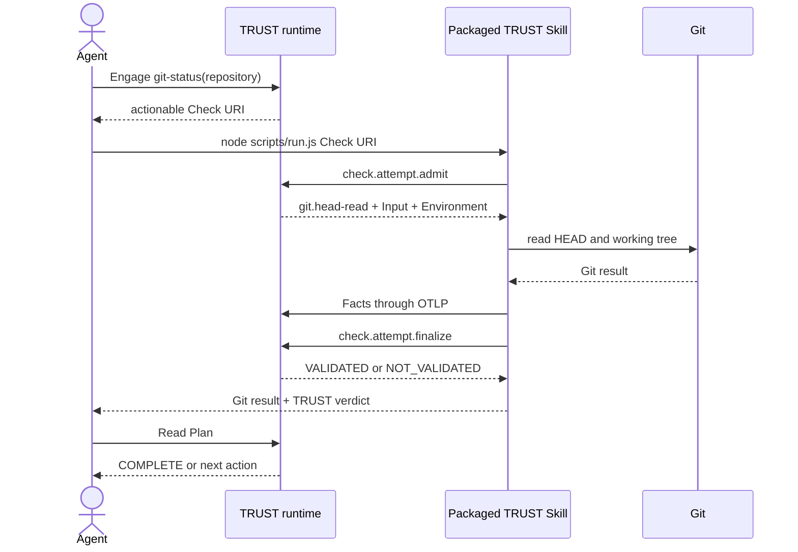

# ADR 0004 — First complete local product slice

Status: accepted for the current local integration slice.

## Boundary

| Input | Value |
|---|---|
| Procedure | `git-status@2.0.0` |
| Plan input | one `repository` |
| Check | `repository status` |
| Operation | `git.head-read` |
| Skill | one packaged TRUST Skill |
| Process | Node |
| TRUST policy | `local` |
| Transport | MCP Plan reads, RPC admission/finalization, OTLP Facts |

This slice proves the complete runtime boundary with the smallest Procedure. It does not claim the
advanced `verified` release and deployment path.

## Sequence

## Required public evidence

The slice is accepted only when public-boundary tests prove:

1. the Procedure is published and the Plan is engaged without Skill availability checks;
2. MCP shows the exact Check URI, Operation, target, Input and next action;
3. the packaged CLI runs outside the repository with Node;
4. the packaged MCP STDIO entrypoint exposes and runs the same Check;
5. admission happens before Git;
6. Facts enter through OTLP and TRUST returns the verdict;
7. the final MCP Plan read says whether more work remains;
8. no static Skill catalog, Skill-specific server rule or local execution journal participates.
