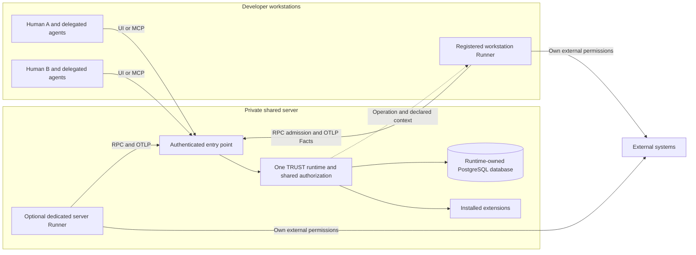

# One shared TRUST server for multiple developers and agents

Date: 2026-09-25. Baseline: `7d651cce67e1556e6a05d3036a2089dc49854300`.
Status: reviewed study and product proposal, not an implementation decision or deployment approval.

Subsequent product decision: native users and creator-token-scoped Plans with `standard` and `extended` roles are specified in [the current access design](shared-server-users-and-runner-spec-2026-09-25.md). The exploratory recommendations below remain source-study history; they do not override that later decision.

## Recommendation and boundaries

Use one central TRUST runtime, one runtime-owned PostgreSQL database, and several authenticated developer clients and Runners. Start with one team-wide space if the owner accepts common visibility. Add individually revocable identities and a small shared authorization policy before presenting the installation as a governed multi-user server. Keep ordinary Check execution on its selected Runner; a workstation Runner and a server-hosted Runner have different external permissions and secret exposure.

The current code already provides public remote-facing protocols, durable Plan history, revision conflicts and composition-scoped transaction serialization. It does not yet attach a verified person/agent/Runner identity to those actions. A private network or shared web password can restrict entry, but cannot supply the missing per-action authorization and attribution by itself. Database serialization does not prevent duplicate external effects.

This recommendation is deliberately bounded: no database shared by multiple runtime owners, no synchronization between installations, no mandatory SaaS tenancy, enterprise directory, distributed scheduler or generic exactly-once/retry engine. Independent installations can each have their own runtime and database. The existing product language remains **Plan + Sessions → Checks**. Sessions remain Plan execution windows; they must not silently become login sessions.

The user-facing proposal is the six-page French Maket document **TRUST — Serveur partagé · proposition multi-utilisateur**, in `Produits/Trust/Architecture`. It is separate from the approved functional model. It presents the target architecture, observed gaps, actors and rights, three journeys, five implementation lots and open choices. The technical detail is supported by three reports:

- [Identity, authentication and authorization](shared-server-identity-study-2026-09-25.md).
- [Collaboration, concurrency and attribution](shared-server-collaboration-study-2026-09-25.md).
- [Developer experience, deployment and operations](shared-server-operations-study-2026-09-25.md).

## Actors and trust boundaries

The diagram is a proposed target. Individual authentication, trusted actor propagation and authorization are additions, not current capabilities. Arrows represent requests/returned grants, not a new host dispatch mechanism.

1. **Client to shared server:** authenticate a human or service principal; separately retain verified delegation and asserted agent/workstation labels. A client cannot create authority by sending an `actor` or `onBehalfOf` string.
2. **TRUST to Runner:** authorize the requested action and Environment before releasing a grant. Bind lifecycle calls to the authenticated executor and delegation. A grant correlates a Check and Attempt; it is not proof of execution.
3. **Runner to external target:** the target authenticates the Runner's external credentials. TRUST permission neither grants an operating-system/cloud permission nor proves the observations are truthful.
4. **Runtime to extensions:** intersect installation capabilities with caller permissions. An extension process is trusted installed code, not an OS sandbox. Its private storage is separate from core storage.
5. **Runtime to database:** clients do not access core SQL directly. The runtime retains one ownership session and a bounded connection pool. This is a single owner design, not high availability or distributed fencing.

The relevant current boundaries are [HTTP mounts](../../packages/trust-runtime/src/http/app.ts#L14), [public admission input](../../packages/trust-extension-sdk/src/index.ts#L509), [grant construction](../../packages/trust-runtime/src/plan/runtime.ts#L893), [Runner RPC client](../../packages/trust-runner/src/check/client.ts#L60), [extension host](../../packages/trust-runtime/src/extensions/host.ts#L50), and [PostgreSQL ownership](../../packages/trust-runtime/src/database/postgres.ts#L7).

## Existing / reinforce / absent

“Existing” means source-verified at the baseline; it does not assert that retained local runtimes have activated this code. “Absent” is scoped to the inspected public/service contracts and paths. No security probe or load experiment was performed.

| Capability | State | Verified mechanism or gap | Shared-server consequence |
| --- | --- | --- | --- |
| One owner and concurrent core transactions | Existing | Dedicated PostgreSQL ownership lock, pool max 8; [adapter](../../packages/trust-runtime/src/database/postgres.ts#L24) | Keep a single owner; size the pilot by measurement, not by interpreting pool size as a user capacity guarantee. |
| Coherent related Plan transitions | Existing | Composition-root advisory transaction lock then root row lock; [transaction](../../packages/trust-runtime/src/plan/transaction.ts#L4) | Siblings and ancestors serialize their state changes. No lock spans an external Operation. |
| Shared editing | Existing; reinforce UX | Complete declarations with revision check; [contract](../../packages/trust-extension-sdk/src/index.ts#L456), [runtime](../../packages/trust-runtime/src/plan/runtime.ts#L644) | Reread and reconcile conflicts; do not blindly retry a stale full replacement at a new revision. |
| Human/agent/Runner identity | Absent | Handlers receive bodies and service dependencies, no common verified actor; [RPC](../../packages/trust-runtime/src/http/rpc.ts#L811), [MCP](../../packages/trust-runtime/src/http/mcp.ts#L69) | Current network admission is not a named-user permission decision. |
| Shared web gate | Existing; reinforce | Optional shared Basic password, stripped before forwarding; [shell](../../packages/trust-shell/src/server.ts#L212) | One password does not provide individual revocation or runtime attribution. |
| Complete authenticated remote ingress | Reinforce | Shell proxy list omits live `/v1/traces`; Runner clients supply JSON headers only; [shell](../../packages/trust-shell/src/server.ts#L19), [RPC client](../../packages/trust-runner/src/check/client.ts#L60), [OTLP client](../../packages/trust-runner/src/telemetry/otlp.ts#L38) | Design RPC and live OTLP together; UI URL alone is insufficient. Protect direct runtime, streams and upgrades too. |
| Projects and teams as access scopes | Absent | Plan metadata is title/labels/annotations; [contract](../../packages/trust-extension-sdk/src/index.ts#L110) | Existing project classification and Environment names must not be assumed to be ACLs. |
| Session/intention ownership | Existing execution semantics; absent actor ownership | Session has Plan/state/timestamps; one Plan intent reservation; [Session](../../packages/trust-runtime/src/model.ts#L130), [reservation](../../packages/trust-runtime/src/plan/store.ts#L201) | Separate shared Plan execution state from individual login, assignment and process liveness. |
| Per-Check external exclusion | Reinforce | Distinct unchained keys can be admitted; same pending key can receive its grant again; [admission](../../packages/trust-runtime/src/plan/runtime.ts#L1560) | Specify pending Check policy and same-key replay separately. Neither current deduplication nor a new claim can guarantee a single external effect. |
| Fact acceptance and qualification | Existing; reinforce producer attribution | Correlation, expiry, Session and Produced checks; [ingestion](../../packages/trust-runtime/src/plan/runtime.ts#L937) | Preserve validation, add verified producer/authority context, never promote an accepted Fact into proof of its external truth. |
| Configuration and external secrets | Existing shared configuration; absent user scopes | Environment values are returned as maps; credential list returns names; [Environment](../../packages/trust-runtime/src/environment/service.ts#L26), [credentials](../../packages/trust-runtime/src/credential/service.ts#L25) | Authorize configuration reads and delegation; do not claim the credential store is automatically injected into live grants. |
| Server execution through trials | Existing; restrict separately | Caller source can be compiled and a child Runner inherits runtime process environment; [trial](../../packages/trust-runtime/src/trial/service.ts#L179) | Authoring/compile access must not silently imply server execution. Establish a dedicated permission and host policy. |
| Extension access | Existing installation grants; absent end-user policy | Environment-scoped projection and installation checks; [routes](../../packages/trust-runtime/src/http/extensions.ts#L69) | Add caller intersection and trusted SDK context across HTTP and MCP; a declared command or read-only hint is not permission. |
| Human response integrity | Existing; absent respondent identity | First response atomically wins, command accepts item/revision/answers; [mobile](../../extensions/mobile-companion/server.mjs#L1252) | Decide who is entitled to answer and persist verified respondent identity if required. |
| Live visibility | Existing; reinforce scope | Bounded process-local event replay, unfiltered subscriber route; [SSE](../../packages/trust-runtime/src/http/events.ts#L9) | Events prompt rereads. They are neither durable actor audit nor a total order of commits. Filter replay/streams if visibility differs. |
| Revocation and usable identity audit | Absent application model | Session closure/expiry constrain execution but contain no principal; [Session model](../../packages/trust-runtime/src/model.ts#L130) | Add revocable credentials/delegations, attributed mutation/refusal history and an explicit in-flight policy. Preserve older asserted attribution as unverified. |
| Readiness and bounded shared load | Reinforce | Health currently reads only the clock; a pool cap does not limit all waiting requests or Trial processes; [health](../../packages/trust-runtime/src/health.ts#L20), [operations analysis](shared-server-operations-study-2026-09-25.md#bounded-load-and-backpressure) | Expose storage-owner failure in readiness and define measured request, queue and execution limits before the pilot. |

## Minimal application proposal

### Identity and access

Start with one authority for principal and client credentials. A stable principal identifies a human or service account; a revocable credential identifies its client installation or authorized delegation. An agent may act on behalf of a human only through a server-verifiable relationship. Keep editable names, model names and machine labels as descriptive metadata unless separately verified. Authentication proves control of a credential, not personal review by a human or physical execution location.

Apply authorization in a shared service boundary used by RPC, MCP, UI-backed requests and extensions. The effective authority should not exceed the principal's current rights, its delegation, the requested resource/Environment scope, and the installed extension's capabilities. Authenticate and authorize live OTLP, finalization and interruption as part of the same Attempt lifecycle. Treat browser-origin protection and CSRF, where applicable, as distinct from authentication. Choose one canonical ingress and prevent ordinary client access to bypass backends.

For a managed private team, individually provisioned client credentials may be a first deployment choice. Standards-based remote MCP authorization is an alternative when client interoperability requires it. The [identity report](shared-server-identity-study-2026-09-25.md#small-access-options-and-recommendation) distinguishes the current official MCP guidance from TRUST's implementation. Choosing OAuth for MCP would not by itself secure RPC, OTLP or extensions. The credential mechanism and client support remain decisions, not a selected provider.

### Small action model

Three responsibilities are sufficient for an initial discussion, with explicit permissions rather than an assumption that a role has all powers:

| Responsibility | Proposed minimum | Explicitly separate |
| --- | --- | --- |
| Installation administrator | Enroll/revoke clients, configure Environments/catalog sources/extensions, operate backup/recovery | External execution rights; administration alone need not permit all Operations. |
| Developer with delegated agents | Read the shared team work, create/engage Plans, replace allowed declarations, request permitted Checks | Executable publication, sensitive Environments, server trials, supervising another participant and human decisions. |
| Registered Runner | Obtain its authorized Operation and submit correlated Facts/finalization | Global read, authoring, publication and administrative access. |

An optional read-only participant can be added if needed; it is not required to invent a broad organization hierarchy. Qualification remains exclusively TRUST's job. Permission to supply dry-run Facts or to request finalization does not permit choosing a verdict. Human response, catalog editorial updates, executable publication, registry synchronization and server trials are different actions and may deserve different grants. The [detailed action matrix](shared-server-identity-study-2026-09-25.md#proposed-minimal-permission-matrix) covers these boundaries.

### Runner placement and secrets

A workstation Runner is appropriate when the action needs that checkout, local tools or the developer's own external permissions. A dedicated server Runner is appropriate when shared external credentials must remain on the server. The latter is a deployment choice, not an existing generic job scheduler or automatic remote dispatch feature. The current central-host Trial path is separate and must be restricted explicitly.

Define where an Operation's file paths, executable names, localhost URLs and external credentials resolve. A central Environment name alone does not establish a portable workspace or allocate a machine. The Runner already accepts separate RPC/OTLP endpoints and requires safe HTTP transport; remote onboarding must cover both endpoints and authentication together. Do not weaken TLS or embed credentials into URLs to make the existing clients connect. Avoid putting secrets in ordinary Environment maps: their listing and delegated values are observable to currently admitted callers. Keep external credentials at the selected executor and configure only the required access.

### Collaboration and audit

Recommended first collaboration rule, subject to approval: refuse a second distinct pending live Attempt for the same Check regardless of intent chaining; preserve allowed concurrency across different Checks and child Plans. Current chained Plans already reserve one intent across the whole Plan, so any change to this granularity needs a product decision. Bind the Attempt to the authenticated executor, but specify same-key re-admission and authorized takeover independently. A transport retry must never be interpreted as evidence that external work did not start.

Use domain idempotency/reconciliation when supported by the target. If an unknown outcome cannot be replayed safely, use human intervention. Closing a Session, expiry or credential revocation does not stop a disconnected external process and does not undo its effect. Decide whether a revoked in-flight executor may report through a restricted completion path or is refused; in either case keep known history and expose the unresolved external outcome.

Useful audit connects verified initiating principal, verified delegation, executor credential, action/resource/Environment, Attempt and accepted Facts/verdict. Denials and supervisory actions need attribution too. Existing Fact digests and immutable historical data must not be rewritten to assign identities retrospectively. Keep asserted historical `mcp-agent`, `local-operator`, assignee and author values visibly unverified. Do not create new Proof, Evidence or Binding resources; qualify through the existing domain history and use OpenTelemetry traces within the established governance contract.

## Three concrete journeys

These are proposed target behavior and source-derived gaps, not journeys executed in this study.

1. **Onboard a second developer.** An administrator creates an individually revocable access and allowed Environment scope. The developer connects the agent's remote MCP and configures the packaged Runner's RPC and live OTLP endpoints; installs the required local tools and external credentials. The developer reads the shared catalog, engages a Plan, and invokes its supplied semantic URI. The team sees current state; the history identifies human delegation and executor. Current gap: endpoint configurability exists, but common identity/authentication and authorization do not.
2. **Collaborate on one Plan.** A and B read revision N. A's declaration change advances it; B receives a conflict and consciously reconciles. Two Runners targeting the same live Check follow the chosen pending-admission rule. A repeated grant for the same key does not imply that restarting execution is safe. The UI distinguishes Plan intent from verified actor/Runner status. Current gap: revision checks exist, chained distinct-key reservation exists, but unchained admission and same-key replay do not establish external exclusivity.
3. **Revoke a developer or lost workstation.** Disable the specific credential/delegation, reject new requests and reauthorize or close existing streams. Examine pending Attempts and apply the chosen completion policy. Revoke exposed external credentials at their owner if necessary. Retain the identity and past outcomes for audit. Current gap: no principal/client revocation model; Session expiry/closure is a separate mechanism and cannot recall a running external action.

## Ordered implementation lots and future public acceptances

No lot is authorized for implementation by this study. Before implementing, approve the identity authority, common-versus-restricted visibility and in-flight/replay decisions. Cross-surface denials must be tested as rigorously as successful journeys.

| Lot | Deliverable | Future public acceptance |
| --- | --- | --- |
| 1. Entry points and identities | Common identity context; browser and managed-client authentication; RPC/OTLP routing; direct-backend restrictions; per-client revocation | Two workstations connect. Missing/revoked credentials are refused across MCP, RPC, OTLP, SSE, WebSocket/LSP and extension paths. Supplied actor headers cannot impersonate another principal. Verify real configured ingress, not just isolated handlers. |
| 2. Action rights and secrets | Shared policy for Plan actions, catalogs, Environments, server trials, configuration and extensions; trusted delegation context | Allowed developer succeeds, denied developer/Runner receives no protected data or delegated values. Authoring alone cannot start a server Trial process. Extension rights cannot exceed caller and installation scope. |
| 3. Collaboration and recovery semantics | Explicit pending-Check policy, same-key replay, handoff, Session supervision, current-revision conflict UX | Use two actual packaged Runners against a disposable observable external target. Count effects independently from Attempts/Facts/verdicts; cover chained/unchained, distinct/same key, expiry and dependency cascade. |
| 4. Attribution and visibility | Verified actor/delegator/executor history, human responder identity where chosen, denial/supervision traces, reconnect behavior | Follow a success, refusal, declaration conflict and takeover to the correct identities. A client missing events rereads current state. Scoped viewers cannot infer hidden resources through lists/counts/history/replayed events. |
| 5. Operable pilot | Installation guide, compatible Runner deployment, consistent backup set/restore protocol, bounded capacity objectives | Restore core data plus Operation files, configuration and extension stores into an isolated installation; verify historical reads and governed continuation. Pilot independent and shared Plans from several clients; measure response time, lock waits, resource pressure and event subscribers. |

A first useful pilot is two named developers, one Plan each, then a shared Plan and an explicit revocation exercise. Choose acceptable outage and data-loss windows before promising availability. Retain the single runtime owner throughout: recovery is a controlled stop/restore/start sequence, not simultaneous active runtimes. The recovery set includes PostgreSQL, executable Operation files, extension installation/configuration and each extension's own persistent data, plus appropriate secret reprovisioning. Core SQL backup alone is insufficient to reconstruct the whole installation. No workload capacity or recovery time is asserted without measurement.

## Decisions still owned by the product owner

| Decision | Small trusted-team option | Stronger separation consequence |
| --- | --- | --- |
| Visibility | Every member reads team Plans/catalog/history | Define real resource scopes and filter every list/read/search/count/stream/replay/extension path. Labels alone are not boundaries. |
| Agent authority | Human-owned bounded delegations; optional independent automation identity | Define service ownership, expiry, delegated grants and which authority can supervise another actor. |
| Execution location | Local Runner for workstation work; explicit server Runner for selected Environments | Enforce eligible executor scope and machine/secret isolation. A device label alone is not attestation. |
| Work ownership | Check-level pending policy plus existing Plan intent semantics | Decide handoff/takeover, permitted parallelism and who can close/resume a shared Session. |
| Human response | Any allowed team reviewer, or one named reviewer | Persist verified reviewer and reflect authority in response/Fact contracts where qualification needs it. |
| Revocation in flight | Stop new requests and explicitly handle pending completion | Choose reporting grace/refusal, stream invalidation, external reconciliation and audited supervisory decisions. |
| Authentication integration | Managed private clients and one identity authority | Require standard remote MCP OAuth support if client interoperability needs it; avoid two competing identity stores. |
| Operations | Small single-runtime service with a documented restore path | Set measured load, recovery and availability objectives before adding operational complexity. |

The recommended starting point is the trusted-team column with individual identities, not an anonymous shared administration endpoint. Choosing common visibility reduces scope; it does not remove the need to distinguish execution, configuration, publication and server-trial permissions.

## Review, evidence and delivery status

The coordinator independently inspected the three reports and cross-checked public mounts, configuration/credential services, grant construction, pending admission and intent reservation, Session model, mobile response transaction, server Trial spawn, events and PostgreSQL ownership against source. Code Moniker generation 4 supplied the runtime composition graph (32/32 reported outgoing neighbors; 10 unresolved references); workers recorded their generation 5 bounded queries and unresolved coverage. These are structural facts and source-derived reasoning, not behavioral acceptance or a penetration test.

The three new missions are `shared-server-study-identity-20260925`, `shared-server-study-collaboration-20260925` and `shared-server-study-operations-20260925`, classified under `trust-shared-server-study`. Creation precedes host dispatch; worker claim/response and coordinator observation use the public Runner. The [dedicated board](http://127.0.0.1:4180/extensions/coordination?coord.project=trust-shared-server-study) tracks these study missions separately from the closed storage migration missions.

All three coordinator observations returned `COMPLETED` with `VALIDATED`; subsequent public Plan reads show `COMPLETE`, revision 6, and 4/4 satisfied Checks. This establishes the persisted mission response workflow, not behavioral validation of the proposed shared server. The six Maket pages passed layout checks and were visually reviewed; no pending Maket feedback remained. A portable copy was exported as `trust-serveur-partage-proposition-2026-09-25.maket` in the Maket exports directory.

Final static qualification: `code-moniker check . --report` reported zero violations across 689 scanned files. All 166 local document links resolved, including checked source line positions. The 15 excluded quiz files retained their pre-study SHA-256 hashes. The tracked checkout remains unchanged on `main`; the four study reports are new uncommitted documents.

Only documentation, the requested Maket proposal and necessary coordination transitions were produced. No functional code, account, permission, secret, network or runtime configuration was changed for this study. No tests, intrusive probes, load runs, commits, pushes or activation were performed. The earlier storage commit remains `7d651cc`. The quiz files remain outside this work.
