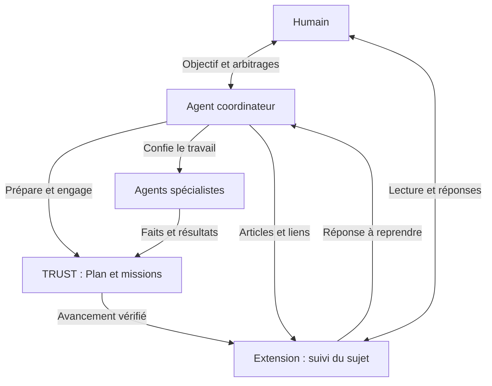
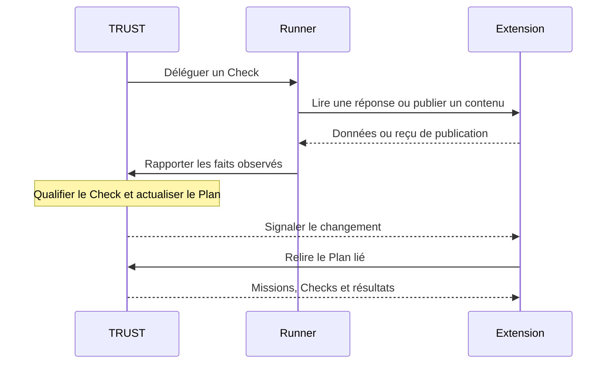

# TRUST — des procédures au suivi d’un projet

TRUST structure le travail confié aux agents : méthode, délégation, vérification et résultats. L’extension mobile en propose une première utilisation sur des projets réels. Elle réunit les productions et leur avancement autour d’un **sujet**.

## Une procédure organise le travail

Une **procédure** décrit les étapes, les données attendues et les conditions de réussite. Son exécution prend la forme d’un **Plan**. Celui-ci peut confier des missions à des procédures enfants et reprendre leurs résultats.

Les opérations réalisent les actions. Les **Checks** vérifient les faits rapportés et déterminent la progression du Plan. Chaque exécution conserve ainsi son parcours, ses résultats et les éléments ayant permis de les qualifier.

## Trois acteurs, un espace partagé

| Acteur | Rôle |
| --- | --- |
| Humain | Formule l’objectif, précise les attentes, examine les productions et prend les décisions. |
| Agent coordinateur | Prépare les procédures, répartit les missions, suit leur exécution et présente les résultats. |
| Agents spécialistes | Réalisent les missions confiées et remettent leurs productions et observations. |

L’agent pilote le travail ; TRUST en organise les dépendances et les vérifications. L’extension donne à l’humain un point de consultation et de réponse. Une réponse enregistrée peut être reprise par une opération, puis évaluée selon la procédure concernée.

## Le sujet rassemble les productions

Le **projet** fournit le cadre. Son **fil** présente les publications datées. Le **sujet** relie les sources utiles à un même travail, avec une identité conservée au fil de son évolution.

| Autour du sujet | Ce que l’on retrouve |
| --- | --- |
| Contexte | L’objectif et la description du travail suivi. |
| Articles et documents | Les explications, propositions et livrables ; les versions d’un article restent consultables. |
| Exécution | Le Plan lié, ses missions, leurs vérifications et leurs résultats. |
| Décisions | Les réponses humaines enregistrées et explicitement rattachées au sujet. |

Cette réunion donne deux lectures complémentaires : **ce que le travail produit** et **comment il avance**. Les liens permettent de passer d’une source à l’autre en conservant le sujet comme repère.

## Un parcours concret

**Faire évoluer l’extension** : l’humain exprime le besoin ; le coordinateur prépare une proposition et répartit les missions ; les spécialistes produisent et vérifient ; le sujet rassemble l’article, la maquette et le Plan. L’humain consulte cet ensemble et répond lorsqu’un arbitrage lui est présenté.

Le prototype propose déjà ce rapprochement par liens explicites. Sa vue d’exécution suit actuellement un Plan principal et ses missions. L’exploration transversale de plusieurs Plans et l’organisation automatique des connaissances restent à concevoir.

## Comment les données circulent entre TRUST et l’extension

L’extension est une application distincte du moteur TRUST, hébergée dans son interface. Elle conserve les sujets, articles, documents référencés et réponses. TRUST conserve les procédures et l’historique de leur exécution. Un identifiant de Plan relie le contenu présenté à l’exécution suivie.

| Moment | Dans TRUST | Dans l’extension |
| --- | --- | --- |
| Construction | L’agent décrit le contexte, les étapes, les opérations et les critères des Checks ; TRUST compile la procédure. | L’agent peut publier une présentation ou une proposition. Cette publication est explicite. |
| Engagement | TRUST crée un Plan et fixe les versions des procédures utilisées. | Un élément du fil référence ce Plan ; le sujet rassemble cet élément avec les autres productions. |
| Exécution | Le Runner réalise les opérations et rapporte des faits ; TRUST qualifie les Checks et actualise le Plan. | L’écran relit les missions, les Checks et les résultats du Plan lié. |
| Production | Une opération peut écrire dans un système externe et rapporter le résultat observé. | Un contenu est publié par une commande MCP de l’agent ou par une opération conçue pour appeler l’API. |
| Réponse humaine | Une opération lit la réponse ; le Check applique les critères de la procédure. | Le formulaire conserve la réponse et sa révision. |

**Lecture et actualisation.** L’extension lit une projection du Plan par HTTP, avec les permissions `plans.read` et `plans.subscribe`, dans l’environnement autorisé. Un abonnement SSE signale les changements ; l’écran relit alors les données. Les changements de contenu de l’extension suivent également ce mécanisme d’actualisation.

**Échange par opération.** Le parcours ci-dessous s’applique lorsqu’une procédure prévoit cet échange avec l’extension. Le connecteur de lecture d’une réponse existe ; chaque publication automatisée doit être définie dans l’opération correspondante.

Le **contenu éditorial** et l’**état d’exécution** se rejoignent dans le sujet. Leurs sources restent identifiables : une publication vient de l’agent ou d’une opération ; l’avancement vérifié vient de TRUST.
