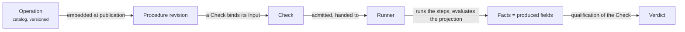

An <Term id="operation">Operation</Term> says **how to call one external system** and **which typed fields that call produces**. It does not decide whether a result is good, does not know Plans or Checks, and never qualifies. A Procedure can therefore reuse one Operation in several Checks with different qualifications.

> An Operation observes or acts; the qualification belongs to the Check that uses it.

```gherkin operation id="git.head-read" title="git.head-read — a complete Operation"
# language: en
@trust-dsl:1 @operation:git.head-read @version:1.0.0
Feature: Read Git HEAD and working tree

  Background: Operation interface
    Given Environment
      | name          | type      |
      | workspaceRoot | directory |
    And Input
      | input   | type      | cardinality |
      | project | reference | one         |
    And Produced fields
      | field        | type      | cardinality | domain                |
      | headRevision | reference | one         | any                   |
      | workingTree  | string    | one         | enum "clean", "dirty" |

  Scenario: Run
    When Shell "head" runs "git" with cwd from Environment "workspaceRoot" and Input "project"
      | argument  | source  |
      | rev-parse | literal |
      | --verify  | literal |
      | HEAD      | literal |
    And Shell "status" runs "git" with cwd from Environment "workspaceRoot" and Input "project"
      | argument                 | source  |
      | status                   | literal |
      | --porcelain=v1           | literal |
      | --untracked-files=normal | literal |
    Then Produce with JSONata
      """
      {
        "headRevision": $trim(steps.head.stdout),
        "workingTree": $trim(steps.status.stdout) = "" ? "clean" : "dirty"
      }
      """
```

## What an Operation is made of

| Part | Where | Role |
| --- | --- | --- |
| Identity | tags on `Feature:` | a stable `@operation:<domain>.<action>` name, a semantic `@version`, the language version `@trust-dsl:1`, optional `@x-<key>:<value>` classification |
| Title and description | `Feature:` line and the free text under it | what the Operation observes, for humans; reported by the compiler, never used by execution |
| **Interface** | `Background:` | typed `Input` (given by the Check), typed `Environment` (given by the Environment at admission) and the exact `Produced fields` |
| **Steps** | `Scenario: Run` | ordered Shell, File-read or HTTP steps, each named, each with a fixed result shape |
| **Produce** | last step, `Then Produce with JSONata` | one closed expression turning Input, Environment and step results into exactly the produced fields |

## How an Operation is used



1. **Authoring.** The `.feature` is written in the interface or an editor. The compiler returns one compiled Operation, or a diagnostic with a line.
2. **Publication.** A Procedure that uses the Operation embeds its exact compiled form. A later catalog change never alters an existing Procedure revision.
3. **Execution.** When a Check is admitted, the <Term id="runner">Runner</Term> receives the compiled Operation, the admitted Input and the Environment values. It runs the steps and evaluates the projection. The produced fields are the <Term id="fact">Facts</Term> TRUST qualifies.
4. **Rehearsal.** In the interface, **Simulate** evaluates the projection on step results typed by hand; **Run** executes the Operation on the current Environment, outside any Plan.

<Callout kind="rule">
  An Operation may create, update, delete, publish or deploy when its contract requires it. It may never qualify: the Runner acts, TRUST decides.
</Callout>

## Where to go next

<PageCards />
