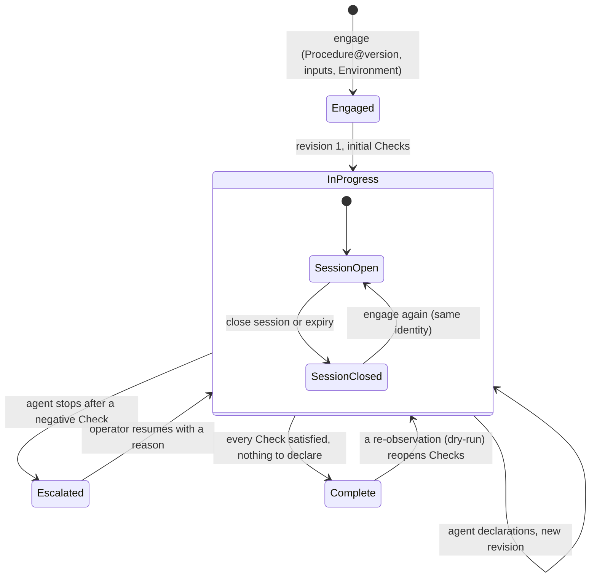

A <Term id="plan">Plan</Term> is one Procedure engaged with concrete inputs in one Environment. It carries the **current revision** of its Checks: which are open, satisfied or actionable. Every accepted execution produces the next revision. Its <Term id="session">Session</Term> is the open period of work on it. While the Session is open, an agent (live) or the operator (<Term id="dryRun">dry-run</Term>) can execute Checks.

> A Plan never changes its identity: same Procedure version, same inputs, same Environment, same mode, revision after revision.

## In short

- **Engage:** choose a published Procedure version, an Environment, a Plan identifier and the root inputs. Revision 1 is built; the Checks whose prerequisites are met are actionable. [Engaging a Plan](/docs/plans/engage).
- **Follow:** use the Plan page to read its summary, checklist, live graph, hydrated source and revision history. [Following a Plan](/docs/plans/follow).
- **Rehearse:** in a dry-run, the operator plays the agent from the cockpit, declares the context, enters Facts, reads verdicts and cascades, and may re-observe, reset or delete. [Rehearsing with a dry-run](/docs/plans/dry-run).
- **Delegate:** in a live Plan, the agent reads the Plan and hands Checks to the Runner. [What the agent does](/docs/plans/agent).
- **Maintain continuity**: an intent-chained Plan asks the agent to link the current Check to the next intended work. The intent records direction but never affects qualification. [Intent, continuity and escalation](/docs/principles/intent-and-escalation).
- **Escalate**: after a negative Check, the agent can state why it cannot continue within scope and which forbidden action it will not take. The Check stays open until an operator resumes the Plan.
- **Close:** closing the Session keeps the Plan and its history; nothing can be admitted until it is engaged again.
- **History:** read every verdict ever computed, its reason and the Checks it reopened. [Check history](/docs/plans/history).

<Compare leftTitle="Live Plan" rightTitle="Dry-run"
  left={<ul><li>Facts reported by the Runner.</li><li>Environment values delegated at each admission.</li><li>Cannot re-observe a satisfied Check or be deleted because its history is retained. The Session is closed instead.</li></ul>}
  right={<ul><li>Facts typed by the operator.</li><li>No Environment value delegated; nothing external runs.</li><li>Can re-observe a satisfied Check; can be reset or deleted.</li></ul>} />

<PageCards />
