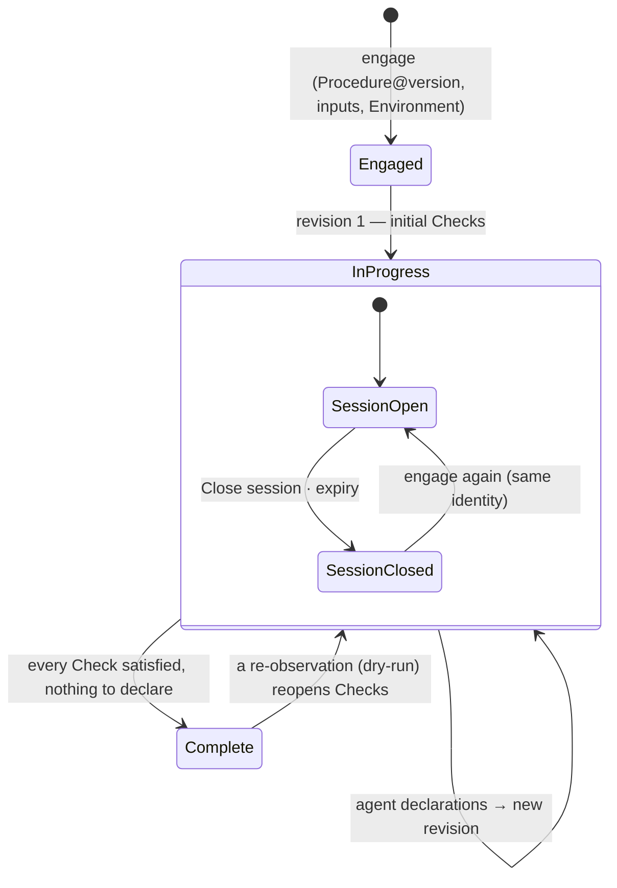

A <Term id="plan">Plan</Term> is one Procedure engaged with concrete inputs in one Environment. It carries the **current revision** of its Checks — which are open, satisfied, actionable — and every accepted execution produces the next revision. Its <Term id="session">Session</Term> is the open work on it: while it is open, an agent (live) or the operator (<Term id="dryRun">dry-run</Term>) can execute Checks.

> A Plan never changes its identity: same Procedure version, same inputs, same Environment, same mode, revision after revision.

## In short

- **Engage** — choose a published Procedure version, an Environment, a Plan identifier and the root inputs. Revision 1 is built; the Checks whose prerequisites are met are actionable. [Engaging a Plan](/docs/plans/engage).
- **Follow** — the Plan page: summary, checklist with states and verdicts, live graph, hydrated source, revision history. [Following a Plan](/docs/plans/follow).
- **Rehearse** — a dry-run: the operator plays the agent from the cockpit, declares the context, enters Facts, reads verdicts and cascades; can re-observe, reset, delete. [Rehearsing with a dry-run](/docs/plans/dry-run).
- **Delegate** — a live Plan: the agent reads the Plan and hands Checks to the Runner. [What the agent does](/docs/plans/agent).
- **Close** — closing the Session keeps the Plan and its history; nothing can be admitted until it is engaged again.
- **History** — every verdict ever computed, with its reason and the Checks it reopened. [Check history](/docs/plans/history).

<Compare leftTitle="Live Plan" rightTitle="Dry-run"
  left={<ul><li>Facts reported by the Runner.</li><li>Environment values delegated at each admission.</li><li>Cannot re-observe a satisfied Check; cannot be deleted (audit history) — the Session is closed instead.</li></ul>}
  right={<ul><li>Facts typed by the operator.</li><li>No Environment value delegated; nothing external runs.</li><li>Can re-observe a satisfied Check; can be reset or deleted.</li></ul>} />

<PageCards />
