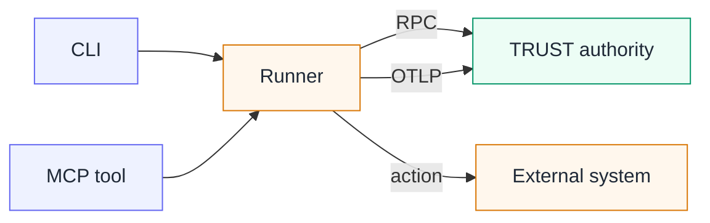

The earlier principle pages described an agent system and the TRUST authority without imposing a technical layout. This page names their components. The **TRUST runtime** embodies the authority: it carries published Procedures, maintains Plans and applies qualifications. The **Runner** is the execution component: it performs one authorized external action and reports the observations.

The agent reasons and chooses; the Runner executes and reports. Both belong to the same agent system, even when an integration places them in different processes or on different machines. That separation prevents the component that performs an action from deciding for itself what the action established.

<Figure caption="The agent and Runner form one agent system. The TRUST runtime remains the authority that admits work and qualifies observations.">
  <ArchitectureFigure />
</Figure>

## Compiling an actionable Check

1. **Authors write Operations and Procedures.** Both use the closed TRUST languages built on English Gherkin. Product Action Contracts give Produced Facts their reusable product meaning; an Operation makes one interaction executable; a Procedure places it in ordered and bounded work.
2. **The compiler rejects incomplete definitions.** It resolves the closed vocabulary, types, dependencies and expressions. A published Procedure version is immutable and embeds the exact compiled Operations it needs.
3. **The runtime engages the Procedure as a Plan.** Concrete root inputs and one Environment create the initial Checks and open a Session. The Plan keeps their current state, dependencies, immutable history and optional intention.
4. **The agent selects an actionable Check.** It reads the current Plan and gives the Runner only the semantic Check URI supplied by TRUST: the stable address of that Check in its Plan and Session. It does not reconstruct the Operation or receive the Environment directly.
5. **The Runner requests admission and acts.** TRUST verifies the Plan, Session, Check, prerequisites, context and Operation. It returns the compiled action and only the Environment values required for this attempt. The Runner executes that action using its own external permissions.
6. **The Runner reports the complete result.** TRUST validates the Fact batch, evaluates the Procedure's qualification, records the new revision and returns the external action result, explicit qualification, reason and next available work.

Admission happens before the external action and establishes permission only. Qualification follows a complete observation report, so a Runner output cannot become its own verdict.

## Component boundaries

| Component | Responsible for | Outside its responsibility |
| --- | --- | --- |
| **Operation and Procedure compilers** | grammar, source diagnostics, types and compiled definitions | state of a running Plan |
| **TRUST runtime** | published definitions, Plan and Session resolution, admission, Fact validation, qualification, history and progression | execution in external systems or authorship of domain rules |
| **Runner** | compiled Shell, file and HTTP execution, external result and complete observation report | qualification or checklist state |
| **Agent integration** | instructions for reading a Plan, choosing a Check, invoking the Runner and interpreting the result | business rules or a second execution protocol |
| **Interface** | authoring diagnostics, catalogs, Plan and dry-run views, Environment administration and operator actions | an alternative path around runtime rules |

The TRUST interface and agent-facing runtime tools are different entrances to the same authority. The Runner's adapters are different entrances to the same execution engine. None carries its own copy of the business rules.

## Where the Runner lives

Runner is a logical responsibility, not a mandatory process boundary. Its placement depends on the integration, while its contract with the agent and the TRUST authority stays the same.

<Compare leftTitle="Beside the agent" rightTitle="Hosted by a server"
  left={<ul><li>The application hosting the agent also hosts or starts the Runner.</li><li>The action uses the permissions and network access available in that agent system.</li></ul>}
  right={<ul><li>A controlled service can host the same Runner responsibility and expose it to the agent.</li><li>The action uses that service's permissions, but TRUST still authorizes and qualifies the work.</li></ul>} />

In either placement, the agent provides one Check, the Runner performs only its authorized Operation and TRUST alone changes the Plan. Hosting execution on a server does not move procedural authority into the Runner.

## Current agent-side adapters

The packaged agent-side integration provides two ways to enter the same Runner engine. The host application around the agent, sometimes called its **harness**, may start a one-shot command or keep a local MCP tool available.

<Compare leftTitle="CLI adapter" rightTitle="MCP adapter"
  left={<ul><li>The harness starts <code>scripts/run.js</code> as a one-shot local process for one Check and reads its JSON output.</li><li>The packaged entry requires Node 24.10 or later.</li></ul>}
  right={<ul><li>The agent host starts and keeps <code>scripts/mcp-stdio.js</code> as a local stdio server.</li><li>It exposes one tool: <code>trust_check_run</code>, with exactly one <code>checkUri</code>.</li></ul>} />

The selected adapter passes the exact Check URI to `createCheckRunner`. The common engine requests admission through RPC, executes Shell, file or HTTP locally with its own permissions, reports Facts through OTLP, finalizes through RPC and returns the action result, qualification and continuation. One invocation handles one Check. It does not choose another Check, loop or retry automatically, and it still requires the TRUST runtime.

<Callout kind="rule" title="The two MCP servers have different jobs">
  The runtime's HTTP MCP endpoint at <code>/mcp</code> lets the agent read and engage Plans, make declarations and escalate. The optional Runner MCP adapter is a local stdio server that adds only <code>trust_check_run</code>. It does not replace the runtime tools, and packaging the skill does not configure it in the agent host.
</Callout>

## Live Plans and dry-runs

Both modes use the same published Procedure, instantiated Checks, qualifications, dependency cascade and history. They differ in the source of observations and whether an external system is touched.

<Compare leftTitle="Live Plan" rightTitle="Dry-run"
  left={<ul><li>The Runner executes Operations and reports Facts.</li><li>The Plan uses one Environment; required values are delegated for each admitted action.</li><li>A satisfied Check is not re-observed.</li><li>The operator follows the Plan and closes its Session.</li></ul>}
  right={<ul><li>The operator enters typed observations and temporarily plays the Runner's reporting role.</li><li>No Environment value is delegated and no external action runs.</li><li>A satisfied Check may be explicitly re-observed.</li><li>The operator can discard the rehearsal when it is no longer useful.</li></ul>} />

A dry-run applies the normal qualification, ordering and reopening rules without executing the Procedure against an external system. See [Plans, Sessions and dry-runs](/docs/plans) for the detailed lifecycle.

## Environments and credentials

An <Term id="environment">Environment</Term> is a named execution context. It supplies directories, service addresses and references to <Term id="credential">credentials</Term>. An Operation declares every Environment value it needs, so compatibility can be checked before execution.

A live Plan is engaged on one explicit Environment. For each admitted Check, the runtime delegates only the values required by its compiled Operation. That is how the Runner learns where a project lives or which service to contact. A dry-run receives none of these values.

Credential values are write-only: they can be set or replaced, never read back or displayed. Operations carry references rather than secrets, and the compiler rejects source that looks like a secret. The Environment selected in the interface is a browser preference used when starting work; it is not hidden in the Plan URL. See [Environments in the interface](/docs/environments) for configuration and compatibility screens.

## Observation reporting

In a live Plan, the Runner emits the Operation's Produced values. TRUST validates the complete batch against the Product Action Contract before persistence. A missing or invalid value changes nothing. An accepted batch creates the immutable Snapshot and current revision described in [Definitions and execution records](/docs/principles/model).

If the exchange is interrupted, the Runner may not know whether the external effect occurred. The agent reads the Plan and Check before choosing a recovery. The Runner can re-observe state without side effects and resubmit a complete batch without repeating an external action whose effect is known. If the effect is unknown and repeating it could be dangerous, the decision returns to the operator. TRUST does not promise generic advanced retry, shared journals or automatic recovery.

The public protocol keeps the same boundaries as the product model:

- The interface and command-line tools call runtime functions through RPC. Agent-facing reads and declarations are exposed as MCP tools; MCP does not proxy raw RPC messages or publish internal DTOs.
- The agent gives the Runner one semantic Check URI. The Runner does not receive an authored Procedure, reconstruct an Operation or select an Environment.
- The Runner requests admission through RPC. Only after the runtime has checked the current Plan, Session, prerequisites, Product Action Contract and Environment does it return the compiled Shell, file or HTTP definition and the context required for that Attempt.
- The Runner emits the complete Produced record as OpenTelemetry traces. It finalizes the Attempt through RPC, where the same runtime validates Facts, computes the qualification and advances the checklist.
- RPC and MCP therefore reach the same runtime functions instead of maintaining separate business rules. Logs and metrics remain outside the governance contract.

See the [Interface reference](/docs/screens) for operator-facing entry points and the [TRUST DSL reference](/docs/language) for the source compiled before these calls occur.

