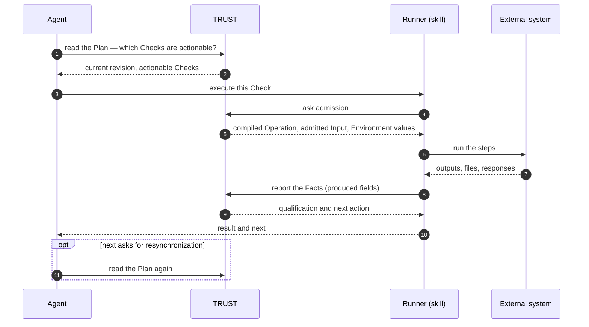

An agent following a Plan does not run commands to prove a Check. It hands the Check to the **Runner** shipped in the TRUST skill; the Runner asks TRUST for admission, performs the compiled Operation, reports the Facts; TRUST qualifies them and returns the verdict. The agent reads results and Plans — it asserts nothing.

> The agent chooses which Check to execute. Everything after that choice is TRUST's: admission, execution contract, Facts, verdict.

## The three parties

| Party | Does | Never does |
| --- | --- | --- |
| **Agent** | reads the Plan, picks an actionable Check, calls the Runner with it, reads `result` and follows `next` | run the Operation's commands itself, fabricate Facts, infer progress from an output, decide a Check is validated |
| **Runner** (in the skill) | asks admission, receives the compiled Operation and its context, runs the steps, evaluates the projection, reports the Facts | qualify, retry on its own beyond the rules, keep state |
| **TRUST** | admits or refuses, provides the exact contract and Environment values, accepts or rejects the Fact batch, qualifies, records, reopens dependents | run anything on an external system |

## What the agent receives

The Runner returns one of:

| Result | Meaning | What the agent does |
| --- | --- | --- |
| **completed · validated** | the Operation ran, the Facts were accepted, the Check is satisfied | follow `next`: run the supplied Check, stop when complete, or read the Plan when asked |
| **completed · not validated** | the Operation ran, the Facts were accepted, a qualification guard is false — its computed reason explains the observation | use the supplied Check `name`, `successReason`, and `checkUri` to retry, or escalate |
| **refused** | nothing ran: the Check is not current, its prerequisites are open, the Session is closed, the contract or Environment does not match | follow the reason and `READ_PLAN` |
| **error** | admission, execution, reporting or finalisation was interrupted: nothing is established | read the Check; retrying is normal (an incomplete Fact batch was rejected whole; the Runner may run the Operation again) |

## What TRUST checks before delegating

Admission validates, in this order: the Check exists in the **current revision** of the Plan; the **Session** is open; every prerequisite Scenario is validated and every Check referenced by the qualification has an active verdict; the Operation embedded in the Procedure is the one the Runner will get; the **Environment** of the Plan provides every value the Operation needs. Only then does the Runner receive the compiled Operation, the admitted Input (resolved from the Plan context) and the Environment values.

Admission is a **grant**: it correlates the Check, the Operation, the context and one attempt key. It is not proof that the action happened — the Facts are.

<Callout kind="rule">
  Every attempt whose Facts are accepted ends with an explicit verdict and a reason. Without accepted Facts there is no qualification: a refusal, a crash or an interruption leaves the Check exactly as it was.
</Callout>

## The skill

The TRUST skill is what an agent installs: an instruction file that tells it the four rules above, the Runner executable, and a reference for reading results. The agent reads Plans and Checks through MCP tools and passes the Runner exactly the Check it was given. See [Connect an agent](/docs/guides/connect-an-agent) for the setup and [Plans](/docs/plans) for what the agent reads.
