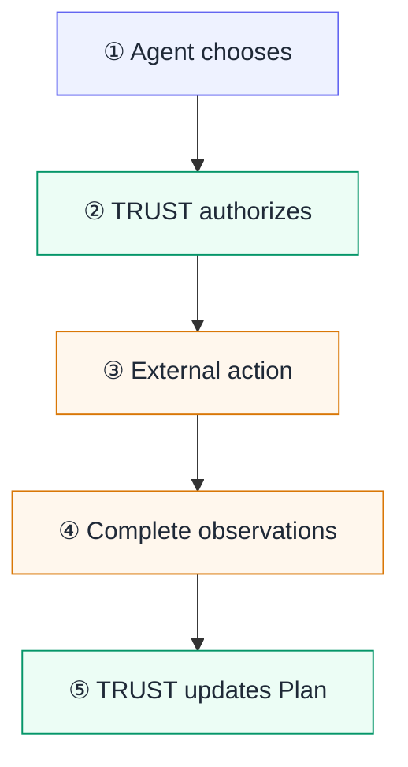

In the risk-report example, several people and systems contribute to one result. The Procedure author decides which source is approved and what variance is acceptable. The external system owner grants access to it. The operator starts and follows this particular run. The agent chooses useful work.

The Procedure author writes the rule; TRUST carries its published version as the authority for the Plan. The agent chooses an actionable Check, but TRUST decides whether the proposed action fits that Procedure and the current context. The agent's system performs an authorized action and reports its observations. If continuing requires a decision outside the written scope, the operator receives that decision back.

TRUST calls the accepted observations **Facts**. They are accepted only as a complete record. The **qualification** is the decision and reason TRUST calculates from those Facts and the Procedure: Facts name the report; qualification names the conclusion.

## Before a Plan starts

The Procedure author defines the questions that must be answered, their dependencies, their qualification rules and the actions that are allowed. Product Action Contracts define the reusable shape and meaning of the Facts those actions must produce. Publishing a new version is required to change those decisions for future work.

The people responsible for an external system decide which credentials and permissions exist there. An **Environment** is the named context selected for the work: it identifies the directories, service addresses and credential references an action may need. TRUST verifies that context before authorizing the action, but does not grant access to the external system. The action still uses the effective permissions available in the agent's system.

The operator engages a published Procedure as a Plan with its concrete business inputs and Environment. The operator follows the work, closes its Session and decides whether a Plan stopped by escalation may resume. The operator does not manually turn an unresolved live Check into a success.

## During one action

One action proceeds as follows.

1. **The agent reads before choosing.** It uses the current Plan, selects a Check whose dependencies are satisfied and proposes only that bounded action.
2. **TRUST exercises the Procedure's authority.** It verifies the current Plan, Check, dependencies and context. It authorizes the exact Operation defined for that Check or refuses the request before the action starts.
3. **The agent's system performs the authorized action.** The external system may accept, refuse or interrupt it according to the permissions that actually exist there.
4. **The agent's system reports the promised observations.** The external result is returned to the agent, but that output does not decide whether the Check is satisfied.
5. **TRUST applies the Procedure.** It accepts only a complete report, qualifies the resulting Facts, records the history and current Plan state, then exposes the next actionable work.

## Responsibilities at a glance

| Party | Responsible for | Not responsible for |
| --- | --- | --- |
| **Procedure author** | acceptance rules, dependencies, reasons and limits | execution of a running Check |
| **External system owner** | credentials and effective access to the target system | the Plan's qualification |
| **Operator** | engagement, oversight, Session closure and resumption after escalation | manual validation of a live Check |
| **Agent** | choice among actionable Checks, current intention and escalation declaration | certification of the action or qualification of Facts |
| **Agent system** | execution of the exact authorized action and complete observation report | the business meaning of the observations |
| **TRUST authority** | application of the published Procedure, action authorization, Fact validation, qualification, immutable history and current Plan state | action in the external system or authorship of business rules |

These are logical responsibilities. The same person may author a Procedure, administer an Environment and operate a Plan, but the decisions remain distinguishable and inspectable.

## Possible outcomes

An action cannot be reduced to “worked” or “failed”. Its result must identify which of the following cases occurred.

| Case | What is known | Consequence |
| --- | --- | --- |
| **Facts accepted; qualification `VALIDATED`** | the attempt completed and the complete observations satisfy the Procedure's rules | the Check becomes `SATISFIED`; continue with the next actionable work |
| **Facts accepted; qualification `NOT_VALIDATED`** | the observations are complete but one written condition does not hold | the Check remains `OPEN`; correct and retry within scope, or escalate |
| **Action refused** | TRUST did not authorize the proposed attempt, so the external action did not start | read the reason and the current Plan before choosing again |
| **Observation report rejected** | the action may have run, but the report omitted or violated part of the required Fact shape | no observation history, conclusion or checklist change is recorded; re-observe and resubmit when possible |
| **Exchange interrupted** | the external effect may be unknown and no accepted Facts establish a new conclusion | read the current state; repeat only when doing so is safe, otherwise return to operator authority |

Authorization permits an attempt; the external result reports what happened. That result is not the verdict. The checklist changes only after TRUST accepts the complete Facts and applies the Procedure. See [Connect an agent](/docs/guides/connect-an-agent) for setup and [What the agent does](/docs/plans/agent) for invocation and recovery rules.
