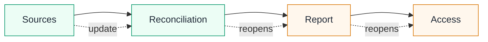

<Compare leftTitle="Missing identity · Food safety" rightTitle="Stale observation · Aviation"
  left={<>
A refrigerated batch reaches a warehouse with a temperature inside the accepted range. The reading might belong to another pallet, predate a break in the cold chain or lack a required laboratory result.

<strong>TRUST must preserve:</strong> observations tied to this batch and this release decision, not merely a reassuring value.
</>}
  right={<>
Fuel, weather and cabin checks were satisfactory when an aircraft was prepared for departure. A later fuel observation changes the basis of that decision.

<strong>TRUST must preserve:</strong> the earlier checks as history while reopening the conclusion that no longer has current support.
</>} />

<Compare leftTitle="Unauthorized source · Financial reporting" rightTitle="Uncertain effect · Payment"
  left={<>
An approved market-data source is unavailable, while a public price is easy to obtain. Using it would change the source policy rather than merely complete the report.

<strong>TRUST must prevent:</strong> a convenient substitution from silently changing a rule owned by someone else.
</>}
  right={<>
A payment request is sent, but the connection fails before the response arrives. The transfer may have occurred.

<strong>TRUST must prevent:</strong> both an invented failure and a replay that could duplicate the payment.
</>} />

In every case, the visible result leaves a material question unanswered. The decision needs a complete observation tied to the right object, a rule for interpreting it and a current view of anything it depends on. When the next decision exceeds the written authority, the work must stop for a person to decide. TRUST records and applies that structure; each domain supplies the rules.

## Risk report example

Consider an agent preparing a portfolio risk report for a management committee. The final step grants a named recipient group access to the report. Before that can be treated as established, the work must answer a chain of concrete questions.

<Steps>
  <Step title="Sources">Which ledger and market-data snapshots were actually used? Their identifiers, dates, coverage and missing exposures matter. A filename such as `approved-data` is not lineage.</Step>
  <Step title="Reconciliation">Do the reported totals match totals recomputed from those exact sources? A spreadsheet command can succeed while an exception remains or the variance exceeds the accepted tolerance.</Step>
  <Step title="Published report">Was the distributed artifact generated from the accepted dataset revision? A correct report left in a working folder does not establish that the same bytes were published.</Step>
  <Step title="Access">Who can open it now? A successful sharing request does not establish the effective access list. That list must match the group authorized for the report's classification.</Step>
</Steps>

The four questions become four Checks in a running Plan:

| Check | Action and complete observations | Qualification written in the Procedure |
| --- | --- | --- |
| Source set | Read the approved ledger and market-data snapshots. Report their identifiers, observation times, coverage and missing exposures. | The snapshots cover the requested portfolio and reporting date; every material exposure has an approved source. |
| Reconciliation | Recompute aggregates from that source set. Report the recomputed total, published total, variance and unresolved exceptions. | The variance is within the stated tolerance and no material exception remains unexplained. |
| Report artifact | Read the generated report metadata. Report its dataset revision, generation time and content digest. | The artifact was generated from the exact dataset accepted by the earlier Checks. |
| Distribution | Apply the declared access grant. Read back the resulting access list and report it. | The effective recipients are exactly the authorized group for the report classification. |

The meaning and required shape of the observations are written in advance. The Procedure states which sources, tolerance and recipients are accepted for this work. None of those decisions comes from TRUST; TRUST applies them and keeps their application inspectable.

## What changes when a source changes

Suppose a later observation shows that one market-data snapshot was incomplete. The earlier record is not erased: it remains part of the history. The current qualification of the source Check changes, however, so the reconciliation, artifact and distribution Checks reopen. The Plan no longer presents conclusions built on that source as current.

This behavior prevents a subtle failure. Without dependency-aware current state, a report can retain a row of green results even after its foundation has changed. Reopening does not claim that every downstream action was badly executed. It says that its conclusion must be established again from the current dependencies.

## What happens when the approved source is unavailable

If the source Check returns complete observations showing that a snapshot is missing, the observation report is accepted but the Check remains unresolved. The agent may retry the approved source or use another remedy explicitly allowed by the Procedure. It must not substitute an unapproved public price, change the reporting date, widen the tolerance or distribute an incomplete report merely to finish the Plan.

When the authorized remedies are exhausted, the agent records the missing snapshot as the blocker and the prohibited substitution as the action it will not take. The report remains undistributed until an operator resolves the source problem or the responsible people publish a new Procedure version.

<Callout kind="note" title="Why this example is not a regulatory claim">
  The example reflects concrete concerns in risk reporting: accuracy, completeness, timeliness, reconciliation, data lineage and appropriate distribution. These concerns appear in the Basel Committee's [risk data aggregation and reporting principles](https://www.bis.org/committees/bcbs/basel-framework/standard/srp/36/inforce/2019-12-15/published/2019-12-15) and its [2026 implementation review](https://www.bis.org/publications/implementation-principles-effective-risk-data-aggregation-and-risk-reporting-bcbs-239-principles). It illustrates how an organization could encode its own controls. It does not establish compliance with those principles.
</Callout>

## Other domain examples

| Domain | Work being delegated | What must be established independently |
| --- | --- | --- |
| Software change | Read a ticket, modify a project, run verification and commit. | The ticket is eligible, the baseline is known, the expected revision was tested and the working tree is in the required state. |
| Patient admission | Read the patient, consent and coverage records, then record admission. | The records refer to the same patient, required consent and coverage are current, and the admission result exists. |
| Aircraft departure | Read aircraft, fuel, weather and cabin state, then release departure. | Each observation applies to the declared flight and remains valid for the departure decision. |
| Food batch release | Read batch, laboratory and cold-chain records, then release the batch. | Required results are complete, traceable to the batch and within the authored acceptance limits. |

TRUST contains no generic definition of a correct release, admission, departure, batch or financial report. Each domain supplies its own observations, Procedures and decision rules.
