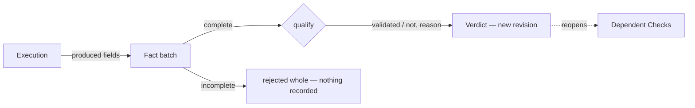

## Facts

A **Fact** is one typed observation: a produced field of an Operation with its value, reported by one execution. On a live Plan the Runner reports them after running the Operation; on a dry-run the operator types them.

A Check is qualified from a **complete batch**: every field declared by its Operation's Product Action Contract must be present. An incomplete batch is **rejected as a whole** — no Fact, no record, no verdict, no change to the Plan. The execution may be repeated; that is the normal answer to a rejection.

Identical Facts submitted twice give the same record once: TRUST deduplicates the batch, the record and the verdict.

## Verdicts

The qualification guards are evaluated in source order against the Facts and the current Plan context.

- All rows hold → **validated**, with the Check's success reason.
- A row fails → **not validated**, with that row's failure reason.

The verdict replaces the Check's active one. Every previous verdict stays in the history with its Facts.

## The cascade

New accepted Facts on a Check recompute its verdict and **reopen every Check that depends on it**:

- the Checks of Scenarios that require its Scenario;
- the Checks that use a role it materializes;
- the Checks whose qualification references one of its fields.

Reopened Checks return to *open*; their previous verdicts stay in the history. The agent resumes from any Check whose dependencies are satisfied.

## Replay

Because rejection is atomic and identical Facts are deduplicated, **replaying** an execution is safe by design: after a rejected batch, an interrupted report or a lost answer, the Runner runs the Operation again. TRUST does not implement a generic exactly-once mechanism; the rare actions that cannot be replayed after an unknown outcome are the operator's business, not a product gate.

<Callout kind="rule">
  Facts and records are immutable history. Only the qualification active in the current revision is replaceable.
</Callout>
