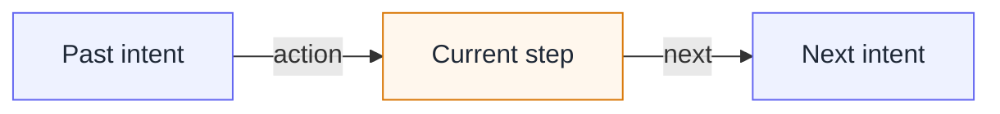

Two failure modes are relevant here. An agent may treat an unobserved result as success, or close the work while an important question remains. Over a long session, a checklist written once at the beginning may also lose its connection with the actions being taken.

Intent chaining states what the agent is trying to accomplish next and carries that direction across the work. Escalation records a normal stop when the agent no longer has the authority or means to continue.

## Escalation

An agent that has no legitimate route forward still has pressure to finish. Without an explicit way out, three common responses can make the record misleading or the action unsafe.

<Callout kind="warning" title="What escalation prevents">
  - **Invented success.** The agent assumes that an expected result exists and continues from a result that was never established.
  - **Premature closure.** It stops without explaining what remains unresolved or who must decide next.
  - **Work outside the agreed scope.** It substitutes a source, relaxes a rule or changes a surrounding system to remove the blocker.
</Callout>

In the risk-report example, an approved market-data snapshot is unavailable. A public price would let the agent complete the spreadsheet, but it would also change the source rule. The agent may retry an authorized source or correction. It may not invent the missing value, choose a new source, widen the tolerance or publish an incomplete report.

An escalation names the observed blocker and the further action the agent will not take. The Check stays unresolved and the decision passes to an operator with a different scope of authority. The work already recorded is preserved. Escalation is part of the normal outcome of bounded delegation.

<Screenshot id="plan-escalated" caption="An escalated Plan keeps the unresolved Check and presents the operator boundary." legend={{
  "overlay.header": "The Plan is visibly Escalated; its identity and Procedure remain unchanged.",
  "plan.summary": "The active escalation states the blocker, the action deliberately not taken and the operator-only Resume action.",
  "plan.checklist": "The Check remains in the checklist. Escalation does not turn it into a success or remove it.",
  "plan.escalation": "The two agent declarations are rendered as audit prose; external images and active content are not executed.",
}} />

## Intent chaining

A checklist shows what remains, but a declaration made once at the beginning does not necessarily hold the thread of a long session. After many actions, the agent can repeat work, follow an outdated direction or decide that its own part is complete while the Plan is not.

When intent chaining is enabled, the agent restates the <Term id="intent">intention</Term> that led to the current Check and declares what it intends to accomplish next. Each completed step therefore creates three anchors:

The next intention becomes the starting point for the following action. If the current question remains unresolved, the previous intention stays in place so that correction and retry retain their context. Only the Check that can complete the Plan omits a next intention.

Intent does not choose the Check, report an observation or decide whether the action succeeded. It records the agent's reason for continuing. The Procedure and the observations still determine the checklist.

The runtime contract is stricter than the conceptual flow above:

- A Procedure opts in with `@intent-chaining`. The first Plan read creates the system-owned current intent.
- Attempt admission requires the exact current value. While work remains, it also requires a distinct next value; one pending Attempt reserves that link.
- Finalization with accepted Facts and `VALIDATED` rotates the next value into the current intent. `NOT_VALIDATED` releases the reservation and preserves the current value. Refusal changes neither value.
- Escalation is accepted only for the latest finalized `NOT_VALIDATED` Attempt of the current open Check. It moves the Plan to `ESCALATED` without creating a Snapshot, verdict or Plan revision.
- `plan.resume` requires the active escalation identifier and a non-empty `resumeReason`. The agent must then read the Plan again and continue from its preserved Check and intent.

See [What the agent does](/docs/plans/agent) for the invocation and recovery flow, and the [TRUST DSL reference](/docs/language) for authored intent-chaining syntax.

