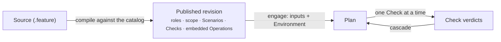

A <Term id="procedure">Procedure</Term> turns a business expectation into questions TRUST can follow. It defines the people, systems and objects involved; the <Term id="check">Checks</Term> to answer; their order; and the actions that are allowed or forbidden while answering them. It may also require the agent to state how one Check leads to the next.

Each Check binds one <Term id="operation">Operation</Term>, the information it needs and a qualification rule. The Procedure is compiled against the Operation catalog and published as a versioned revision that embeds the exact Operations it uses.

> A Procedure says what must be established, in which order, and from which observations. The Operation says how to act on the external system.

## Why write the expectation as a Procedure

An instruction such as “verify the report and share it” leaves important decisions implicit. Which report? Which sources make it reliable? Must verification happen before distribution? What may the agent do if a source is missing? A Procedure makes those decisions visible, reviewable and stable across executions.

The language therefore describes more than a sequence. It records context roles, dependencies, qualification rules and reasons, the authorized scope, and optionally the <Term id="intent">intent chain</Term> that connects one Check to the next.

## How a Procedure is used

<PageCards />
