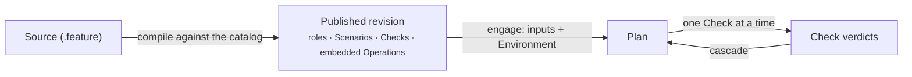

A <Term id="procedure">Procedure</Term> describes a Plan: the typed **roles** of its context, the **Scenarios** that group its Checks and order them, and for each <Term id="check">Check</Term> the Operation it runs, how the context binds the Operation's Input, and the typed **qualification** that makes the Check validated. A Procedure is compiled against the Operation catalog and **published** as a versioned revision that embeds the exact Operations it uses.

> A Procedure says what must be established, in which order, and from which observed fields. It never says how to call a system — that is the Operation's job.

```gherkin procedure id="git-status" title="git-status — the smallest Procedure"
# language: en
@trust-dsl:1 @procedure:git-status @version:2.0.0
Feature: Establish whether a Git repository has local changes

  Answers one question about a repository checked out below the workspace: does it carry
  local changes? A single Check reads the working tree; the Plan is satisfied only when it
  is dirty.

  Background: Plan context
    Given Procedure scope
      | check | authorized | forbidden |
      | all   | Read the declared repository state. | Modify the repository or its environment to obtain the expected state. |
    Given one reference "repository"

  @scenario:repository-status
  Scenario: Read the repository status
    Then Check "repository status" runs Operation "git.head-read"
        on "repository" as Input "project"
        and must establish "the repository has local changes"
      """js
      fact.workingTree === "dirty" ||
      fail("the repository has no local changes")
      """
```

## What a Procedure is made of

| Part | Where | Role |
| --- | --- | --- |
| Identity | tags on `Feature:` | `@procedure:<slug>`, semantic `@version`, `@trust-dsl:1` |
| Title and description | `Feature:` line and the free text under it | what the Procedure establishes, for humans; shown on its page and its Plans |
| **Plan context** | `Background: Plan context` | one typed role per line: a Plan input, an agent declaration, a fixed value, or a value materialized by a Check |
| **Procedure scope** | mandatory first `Given` in the Background | prose boundaries for `all` Checks and optional exact Check names: what is authorized and forbidden |
| **Scenarios** | `@scenario:<slug>` + `Scenario:` | prerequisites (`Given scenario "…" is validated`) followed by one or more Checks |
| **Checks** | `Then Check "…" runs Operation "…" …` | one Operation on a target role, Input bindings, materializations, success reason, `js` qualification |

## How a Procedure is used



1. **Authoring.** The source is written in the interface or an editor. The compiler resolves every referenced Operation, validates every binding and typed qualification, and returns a compiled Procedure or a diagnostic with a line.
2. **Publication.** The runtime stores the revision `procedure@version` with the exact Operations it embeds. It never changes afterwards.
3. **Engagement.** A Plan is engaged from a published version with its root inputs and an Environment; the initial Checks are created. Agent declarations are filled by the agent later; materialized roles are filled by Checks.
4. **Execution.** Checks become actionable when their Scenario's prerequisites are validated; each accepted execution produces a verdict and reopens dependent Checks.

<Callout kind="rule">
  A published revision is autonomous. Editing an Operation of the catalog, or the source of the Procedure, does not change any published version — a new version is published instead.
</Callout>

<PageCards />
