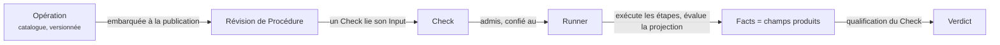

Une <Term id="operation">Opération</Term> dit **comment appeler un système externe** et **quels champs typés cet appel produit**. Elle ne décide pas si un résultat est bon, ne connaît ni les Plans ni les Checks, et ne qualifie jamais. Une Procédure peut donc réutiliser une même Opération dans plusieurs Checks avec des qualifications différentes.

> Une Opération observe ou agit ; l'attente appartient au Check qui l'utilise.

```gherkin operation id="git.head-read" title="git.head-read — une Opération complète"
# language: en
@trust-dsl:1 @operation:git.head-read @version:1.0.0
Feature: Read Git HEAD and working tree

  Background: Operation interface
    Given Environment
      | name          | type      |
      | workspaceRoot | directory |
    And Input
      | input   | type      | cardinality |
      | project | reference | one         |
    And Produced fields
      | field        | type      | cardinality | domain                |
      | headRevision | reference | one         | any                   |
      | workingTree  | string    | one         | enum "clean", "dirty" |

  Scenario: Run
    When Shell "head" runs "git" with cwd from Environment "workspaceRoot" and Input "project"
      | argument  | source  |
      | rev-parse | literal |
      | --verify  | literal |
      | HEAD      | literal |
    And Shell "status" runs "git" with cwd from Environment "workspaceRoot" and Input "project"
      | argument                 | source  |
      | status                   | literal |
      | --porcelain=v1           | literal |
      | --untracked-files=normal | literal |
    Then Produce with JSONata
      """
      {
        "headRevision": $trim(steps.head.stdout),
        "workingTree": $trim(steps.status.stdout) = "" ? "clean" : "dirty"
      }
      """
```

## De quoi est faite une Opération

| Partie | Où | Rôle |
| --- | --- | --- |
| Identité | tags sur `Feature:` | un nom stable `@operation:<domain>.<action>`, une `@version` sémantique, la version du langage `@trust-dsl:1`, une classification optionnelle `@x-<key>:<value>` |
| Titre et description | ligne `Feature:` et texte libre en dessous | ce que l'Opération observe, pour les humains ; rapporté par le compilateur, jamais utilisé par l'exécution |
| **Interface** | `Background:` | `Input` typé (donné par le Check), `Environment` typé (donné par l'Environnement à l'admission) et les `Produced fields` exacts |
| **Étapes** | `Scenario: Run` | étapes Shell, File-read ou HTTP ordonnées, chacune nommée, chacune avec une forme de résultat fixe |
| **Produce** | dernière étape, `Then Produce with JSONata` | une expression fermée qui transforme Input, Environment et résultats d'étapes en exactement les champs produits |

## Comment une Opération est utilisée



1. **Rédaction.** Le `.feature` s'écrit dans l'interface ou dans un éditeur. Le compilateur renvoie une Opération compilée, ou un diagnostic avec une ligne.
2. **Publication.** Une Procédure qui utilise l'Opération embarque sa forme compilée exacte. Un changement ultérieur du catalogue ne modifie jamais une révision de Procédure existante.
3. **Exécution.** Quand un Check est admis, le <Term id="runner">Runner</Term> reçoit l'Opération compilée, l'Input admis et les valeurs d'Environnement. Il exécute les étapes et évalue la projection. Les champs produits sont les <Term id="fact">Facts</Term> que TRUST qualifie.
4. **Répétition.** Dans l'interface, **Simuler** évalue la projection sur des résultats d'étapes saisis à la main ; **Exécuter** exécute l'Opération sur l'environnement courant, hors de tout Plan.

<Callout kind="rule">
  Une Opération peut créer, mettre à jour, supprimer, publier ou déployer quand son contrat l'exige. Elle ne peut jamais qualifier : le Runner agit, TRUST décide.
</Callout>

## Pour aller plus loin

<PageCards />
