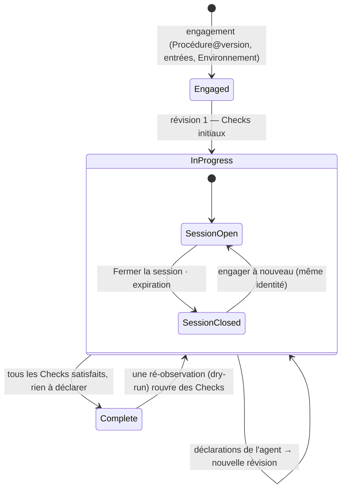

Un <Term id="plan">Plan</Term> est une Procédure engagée avec des entrées concrètes dans un Environnement. Il porte la **révision courante** de ses Checks — lesquels sont ouverts, satisfaits, actionnables — et chaque exécution acceptée produit la révision suivante. Sa <Term id="session">Session</Term> est le travail ouvert sur lui : tant qu'elle est ouverte, un agent (en direct) ou l'opérateur (<Term id="dryRun">dry-run</Term>) peut exécuter des Checks.

> Un Plan ne change jamais d'identité : même version de Procédure, mêmes entrées, même Environnement, même mode, révision après révision.

## En bref

- **Engager** — choisir une version publiée de Procédure, un Environnement, un identifiant de Plan et les entrées racines. La révision 1 est construite ; les Checks dont les prérequis sont réunis sont actionnables. [Engager un Plan](/docs/plans/engage).
- **Suivre** — la page du Plan : résumé, checklist avec états et verdicts, graphe en direct, source hydratée, historique des révisions. [Suivre un Plan](/docs/plans/follow).
- **Répéter** — un dry-run : l'opérateur joue l'agent depuis le cockpit, déclare le contexte, saisit des Facts, lit les verdicts et les cascades ; il peut ré-observer, réinitialiser, supprimer. [Répéter avec un dry-run](/docs/plans/dry-run).
- **Déléguer** — un Plan en direct : l'agent lit le Plan et confie les Checks au Runner. [Ce que fait l'agent](/docs/plans/agent).
- **Fermer** — fermer la Session conserve le Plan et son historique ; rien ne peut être admis tant qu'il n'est pas engagé à nouveau.
- **Historique** — chaque verdict jamais calculé, avec sa raison et les Checks qu'il a rouverts. [Historique des Checks](/docs/plans/history).

<Compare leftTitle="Plan en direct" rightTitle="Dry-run"
  left={<ul><li>Facts rapportés par le Runner.</li><li>Valeurs d'Environnement déléguées à chaque admission.</li><li>Impossible de ré-observer un Check satisfait ; impossible de supprimer (historique d'audit) — on ferme la Session à la place.</li></ul>}
  right={<ul><li>Facts saisis par l'opérateur.</li><li>Aucune valeur d'Environnement déléguée ; rien d'externe ne s'exécute.</li><li>Peut ré-observer un Check satisfait ; peut être réinitialisé ou supprimé.</li></ul>} />

<PageCards />
