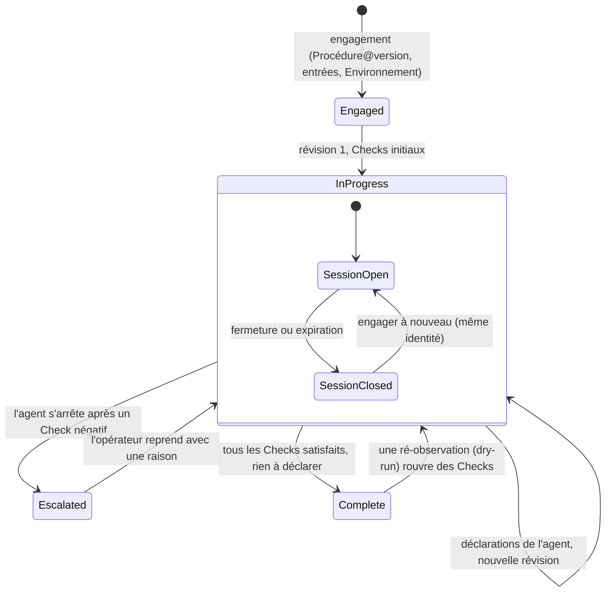

Un <Term id="plan">Plan</Term> est une Procédure engagée avec des entrées concrètes dans un Environnement. Il porte la **révision courante** de ses Checks : lesquels sont ouverts, satisfaits ou actionnables. Chaque exécution acceptée produit la révision suivante. Sa <Term id="session">Session</Term> est la période de travail ouverte sur lui. Tant que la Session est ouverte, un agent (en direct) ou l'opérateur (<Term id="dryRun">dry-run</Term>) peut exécuter des Checks.

> Un Plan ne change jamais d'identité : même version de Procédure, mêmes entrées, même Environnement, même mode, révision après révision.

## En bref

- **Engager :** choisir une version publiée de Procédure, un Environnement, un identifiant de Plan et les entrées racines. La révision 1 est construite ; les Checks dont les prérequis sont réunis sont actionnables. [Engager un Plan](/docs/plans/engage).
- **Suivre :** utiliser la page du Plan pour lire son résumé, sa checklist, son graphe en direct, sa source hydratée et l'historique de ses révisions. [Suivre un Plan](/docs/plans/follow).
- **Répéter :** dans un dry-run, l'opérateur joue l'agent depuis le cockpit, déclare le contexte, saisit des Facts, lit les verdicts et les cascades, et peut ré-observer, réinitialiser ou supprimer. [Répéter avec un dry-run](/docs/plans/dry-run).
- **Déléguer :** dans un Plan en direct, l'agent lit le Plan et confie les Checks au Runner. [Ce que fait l'agent](/docs/plans/agent).
- **Maintenir la continuité** : un Plan avec chaînage d'intention demande à l'agent de relier le Check courant au prochain travail prévu. L'intention enregistre la direction mais n'affecte jamais la qualification. [Intention, continuité et escalade](/docs/principles/intent-and-escalation).
- **Escalader** : après un Check négatif, l'agent peut dire pourquoi il ne peut pas continuer dans son périmètre et quelle action interdite il ne réalisera pas. Le Check reste ouvert jusqu'à ce qu'un opérateur reprenne le Plan.
- **Fermer :** fermer la Session conserve le Plan et son historique ; rien ne peut être admis tant qu'il n'est pas engagé à nouveau.
- **Historique :** lire chaque verdict jamais calculé, sa raison et les Checks qu'il a rouverts. [Historique des Checks](/docs/plans/history).

<Compare leftTitle="Plan en direct" rightTitle="Dry-run"
  left={<ul><li>Facts rapportés par le Runner.</li><li>Valeurs d'Environnement déléguées à chaque admission.</li><li>Impossible de ré-observer un Check satisfait ou de le supprimer, car son historique est conservé. On ferme la Session à la place.</li></ul>}
  right={<ul><li>Facts saisis par l'opérateur.</li><li>Aucune valeur d'Environnement déléguée ; rien d'externe ne s'exécute.</li><li>Peut ré-observer un Check satisfait ; peut être réinitialisé ou supprimé.</li></ul>} />

<PageCards />
