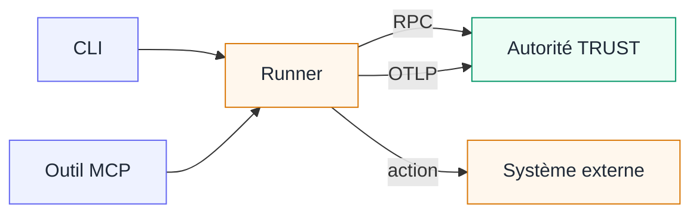

Les pages de principes précédentes ont décrit un système d'agent et l'autorité TRUST sans imposer une organisation technique. Cette page nomme leurs composants. Le **runtime TRUST** matérialise l'autorité : il porte les Procedures publiées, maintient les Plans et applique les qualifications. Le **Runner** est le composant d'exécution : il réalise une action externe autorisée et rapporte les observations.

L'agent raisonne et choisit ; le Runner exécute et rapporte. Tous deux appartiennent au même système d'agent, même lorsqu'une intégration les place dans des processus ou sur des machines différents. Cette séparation empêche le composant qui réalise l'action de décider lui-même ce que cette action établit.

<Figure caption="L'agent et le Runner forment un même système d'agent. Le runtime TRUST reste l'autorité qui admet le travail et qualifie les observations.">
  <ArchitectureFigure />
</Figure>

## Compilation d'un Check actionnable

1. **Les auteurs écrivent des Operations et des Procedures.** Toutes deux utilisent les langages fermés de TRUST fondés sur Gherkin en anglais. Les Product Action Contracts donnent aux Facts Produced leur sens produit réutilisable ; une Operation rend une interaction exécutable ; une Procedure la place dans un travail ordonné et borné.
2. **Le compilateur refuse les définitions incomplètes.** Il résout le vocabulaire fermé, les types, les dépendances et les expressions. Une version de Procedure publiée est immuable et embarque les Operations compilées exactes dont elle a besoin.
3. **Le runtime engage la Procedure sous forme de Plan.** Des entrées racines concrètes et un Environment créent les Checks initiaux et ouvrent une Session. Le Plan conserve leur état courant, leurs dépendances, leur historique immuable et leur intention éventuelle.
4. **L'agent sélectionne un Check actionnable.** Il lit le Plan courant et donne au Runner uniquement l'URI sémantique du Check fournie par TRUST : l'adresse stable de ce Check dans son Plan et sa Session. Il ne reconstruit pas l'Operation et ne reçoit pas directement l'Environment.
5. **Le Runner demande l'admission et agit.** TRUST vérifie le Plan, la Session, le Check, les prérequis, le contexte et l'Operation. Il renvoie l'action compilée et uniquement les valeurs d'Environment requises pour cette Attempt. Le Runner exécute l'action avec ses propres permissions externes.
6. **Le Runner rapporte le résultat complet.** TRUST valide le lot de Facts, évalue la qualification de la Procedure, enregistre la nouvelle révision et renvoie le résultat de l'action externe, la qualification explicite, sa raison et le prochain travail disponible.

L'admission a lieu avant l'action externe et établit uniquement une permission. La qualification intervient après un compte rendu d'observation complet ; la sortie du Runner ne peut donc pas devenir son propre verdict.

## Frontières entre les composants

| Composant | Responsable de | Hors de sa responsabilité |
| --- | --- | --- |
| **Compilateurs d'Operation et de Procedure** | grammaire, diagnostics de source, types et définitions compilées | état d'un Plan en cours |
| **Runtime TRUST** | définitions publiées, résolution des Plans et Sessions, admission, validation des Facts, qualification, historique et progression | exécution dans les systèmes externes ou écriture des règles du domaine |
| **Runner** | exécution compilée Shell, fichier et HTTP, résultat externe et compte rendu complet des observations | qualification ou état de la checklist |
| **Intégration de l'agent** | instructions pour lire un Plan, choisir un Check, invoquer le Runner et interpréter le résultat | règles métier ou second protocole d'exécution |
| **Interface** | diagnostics d'édition, catalogues, vues de Plan et de dry-run, administration des Environments et actions de l'opérateur | voie alternative autour des règles du runtime |

L'interface TRUST et les outils du runtime destinés à l'agent sont des entrées différentes vers la même autorité. Les adaptateurs du Runner sont des entrées différentes vers le même moteur d'exécution. Aucun ne porte sa propre copie des règles métier.

## Où vit le Runner

Runner est une responsabilité logique, pas une frontière de processus imposée. Son emplacement dépend de l'intégration ; son contrat avec l'agent et l'autorité TRUST reste identique.

<Compare leftTitle="Auprès de l'agent" rightTitle="Hébergé par un serveur"
  left={<ul><li>L'application qui héberge l'agent héberge ou démarre aussi le Runner.</li><li>L'action utilise les permissions et l'accès réseau disponibles dans ce système d'agent.</li></ul>}
  right={<ul><li>Un service contrôlé peut héberger la même responsabilité Runner et l'exposer à l'agent.</li><li>L'action utilise les permissions de ce service, mais TRUST continue d'autoriser et de qualifier le travail.</li></ul>} />

Dans les deux placements, l'agent fournit un seul Check, le Runner réalise uniquement son Operation autorisée et seul TRUST modifie le Plan. Héberger l'exécution sur un serveur ne transfère pas l'autorité procédurale au Runner.

## Adaptateurs actuels côté agent

L'intégration empaquetée côté agent fournit deux entrées vers le même moteur Runner. L'application qui héberge l'agent, parfois appelée son **harness**, peut lancer une commande ponctuelle ou maintenir un outil MCP local disponible.

<Compare leftTitle="Adaptateur CLI" rightTitle="Adaptateur MCP"
  left={<ul><li>Le harness lance <code>scripts/run.js</code> comme processus local ponctuel pour un Check et lit sa sortie JSON.</li><li>Cette entrée empaquetée requiert Node 24.10 ou ultérieur.</li></ul>}
  right={<ul><li>L'hôte de l'agent lance et maintient <code>scripts/mcp-stdio.js</code> comme serveur stdio local.</li><li>Il expose un seul outil : <code>trust_check_run</code>, avec un unique <code>checkUri</code>.</li></ul>} />

L'adaptateur choisi transmet l'URI exacte du Check à `createCheckRunner`. Le moteur commun demande l'admission par RPC, exécute localement l'action Shell, fichier ou HTTP avec ses propres permissions, rapporte les Facts par OTLP, finalise par RPC et renvoie le résultat de l'action, la qualification et la suite. Une invocation traite un seul Check. Elle ne choisit pas le Check suivant, ne boucle pas, ne rejoue pas automatiquement et requiert toujours le runtime TRUST.

<Callout kind="rule" title="Les deux serveurs MCP n'ont pas le même rôle">
  Le point d'entrée MCP HTTP du runtime, sur <code>/mcp</code>, permet à l'agent de lire et d'engager les Plans, de faire des déclarations et d'escalader. L'adaptateur MCP optionnel du Runner est un serveur stdio local qui ajoute uniquement <code>trust_check_run</code>. Il ne remplace pas les outils du runtime et l'empaquetage du skill ne le configure pas dans l'hôte de l'agent.
</Callout>

## Plans live et dry-runs

Les deux modes utilisent la même Procedure publiée, les mêmes Checks instanciés, qualifications, cascades de dépendances et historique. Ils diffèrent par la source des observations et par l'exécution éventuelle dans un système externe.

<Compare leftTitle="Plan live" rightTitle="Dry-run"
  left={<ul><li>Le Runner exécute les Operations et rapporte les Facts.</li><li>Le Plan utilise un Environment ; les valeurs requises sont déléguées pour chaque action admise.</li><li>Un Check satisfait n'est pas observé à nouveau.</li><li>L'opérateur suit le Plan et ferme sa Session.</li></ul>}
  right={<ul><li>L'opérateur saisit des observations typées et produit temporairement le compte rendu normalement confié au Runner.</li><li>Aucune valeur d'Environment n'est déléguée et aucune action externe n'a lieu.</li><li>Un Check satisfait peut être explicitement observé à nouveau.</li><li>L'opérateur peut supprimer la simulation lorsqu'elle n'est plus utile.</li></ul>} />

Un dry-run applique les règles normales de qualification, d'ordre et de réouverture sans exécuter la Procedure sur un système externe. Voir [Plans, Sessions et dry-runs](/docs/plans) pour le cycle de vie détaillé.

## Environments et credentials

Un <Term id="environment">Environment</Term> est un contexte d'exécution nommé. Il fournit des répertoires, des adresses de service et des références à des <Term id="credential">credentials</Term>. Une Operation déclare toutes les valeurs d'Environment dont elle a besoin ; la compatibilité peut ainsi être vérifiée avant l'exécution.

Un Plan live est engagé sur un Environment explicite. Pour chaque Check admis, le runtime délègue uniquement les valeurs requises par son Operation compilée. C'est ainsi que le Runner apprend où se trouve un projet ou quel service contacter. Un dry-run ne reçoit aucune de ces valeurs.

Les valeurs des credentials sont en écriture seule : elles peuvent être définies ou remplacées, jamais relues ni affichées. Les Operations portent des références plutôt que des secrets et le compilateur refuse une source qui ressemble à un secret. L'Environment sélectionné dans l'interface est une préférence du navigateur utilisée au démarrage du travail ; il n'est pas dissimulé dans l'URL du Plan. Voir [Environments dans l'interface](/docs/environments) pour les écrans de configuration et de compatibilité.

## Transmission des observations

Dans un Plan live, le Runner émet les valeurs Produced de l'Operation. TRUST valide le lot complet contre le Product Action Contract avant sa persistance. Une valeur manquante ou invalide ne change rien. Un lot accepté crée le Snapshot immuable et la révision courante décrits dans [Définitions et enregistrements d'exécution](/docs/principles/model).

Si l'échange est interrompu, le Runner peut ignorer si l'effet externe a eu lieu. L'agent lit le Plan et le Check avant de choisir une reprise. Le Runner peut observer à nouveau un état sans effet de bord et soumettre un lot complet sans répéter une action externe dont l'effet est connu. Si l'effet est inconnu et que sa répétition pourrait être dangereuse, la décision revient à l'opérateur. TRUST ne promet pas de mécanisme générique de nouvelle tentative avancée, de journal partagé ou de récupération automatique.

Le protocole public conserve les mêmes frontières que le modèle produit :

- L'interface et les outils en ligne de commande appellent les fonctions du runtime par RPC. Les lectures et déclarations destinées aux agents sont exposées comme outils MCP ; MCP ne relaie pas les messages RPC bruts et ne publie pas les DTO internes.
- L'agent donne au Runner une seule URI sémantique de Check. Le Runner ne reçoit pas une Procedure écrite, ne reconstruit pas une Operation et ne sélectionne pas un Environment.
- Le Runner demande son admission par RPC. Le runtime vérifie d'abord le Plan, la Session, les prérequis, le Product Action Contract et l'Environment courants ; il renvoie ensuite la définition Shell, fichier ou HTTP compilée et le contexte requis pour cette Attempt.
- Le Runner émet le compte rendu Produced complet sous forme de traces OpenTelemetry. Il finalise l'Attempt par RPC ; le même runtime valide alors les Facts, calcule la qualification et fait avancer la checklist.
- RPC et MCP atteignent ainsi les mêmes fonctions du runtime au lieu d'entretenir des règles métier séparées. Les logs et les métriques restent hors du contrat de gouvernance.

Voir la [référence de l'interface](/docs/screens) pour les entrées destinées aux opérateurs et la [référence du DSL TRUST](/docs/language) pour la source compilée avant ces appels.

