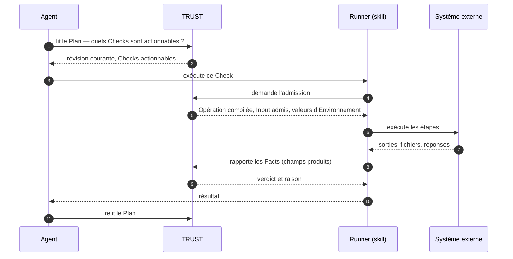

Un agent qui suit un Plan ne lance pas de commandes pour prouver un Check. Il confie le Check au **Runner** livré dans le skill TRUST ; le Runner demande l'admission à TRUST, exécute l'Opération compilée, rapporte les Facts ; TRUST les qualifie et renvoie le verdict. L'agent lit des résultats et des Plans — il n'affirme rien.

> L'agent choisit quel Check exécuter. Tout ce qui suit ce choix appartient à TRUST : admission, contrat d'exécution, Facts, verdict.

## Les trois parties

| Partie | Fait | Ne fait jamais |
| --- | --- | --- |
| **Agent** | lit le Plan, choisit un Check actionnable, appelle le Runner avec, lit le résultat, relit le Plan | exécuter lui-même les commandes de l'Opération, fabriquer des Facts, inférer une progression depuis une sortie, décider qu'un Check est validé |
| **Runner** (dans le skill) | demande l'admission, reçoit l'Opération compilée et son contexte, exécute les étapes, évalue la projection, rapporte les Facts | qualifier, réessayer de lui-même au-delà des règles, conserver un état |
| **TRUST** | admet ou refuse, fournit le contrat exact et les valeurs d'Environnement, accepte ou rejette le lot de Facts, qualifie, enregistre, rouvre les dépendants | exécuter quoi que ce soit sur un système externe |

## Ce que l'agent reçoit

Le Runner renvoie l'un de ces résultats :

| Résultat | Signification | Ce que fait l'agent |
| --- | --- | --- |
| **completed · validated** | l'Opération s'est exécutée, les Facts ont été acceptés, le Check est satisfait | relire le Plan : des Checks dépendants ont pu s'ouvrir |
| **completed · not validated** | l'Opération s'est exécutée, les Facts ont été acceptés, les attentes ne tiennent pas — la raison dit lesquelles | traiter la condition observée ; ne pas la réinterpréter comme une progression |
| **refused** | rien ne s'est exécuté : le Check n'est pas courant, ses prérequis sont ouverts, la Session est fermée, le contrat ou l'Environnement ne correspond pas | lire le Check ou le Plan et suivre la raison |
| **error** | l'admission, l'exécution, le rapport ou la finalisation a été interrompu : rien n'est établi | lire le Check ; réessayer est normal (un lot de Facts incomplet a été rejeté en entier ; le Runner peut exécuter l'Opération à nouveau) |

## Ce que TRUST vérifie avant de déléguer

L'admission valide, dans cet ordre : le Check existe dans la **révision courante** du Plan ; la **Session** est ouverte ; chaque Scénario prérequis est validé et chaque Check référencé par une attente a un verdict actif ; l'Opération embarquée dans la Procédure est celle que le Runner recevra ; l'**Environnement** du Plan fournit chaque valeur dont l'Opération a besoin. Alors seulement le Runner reçoit l'Opération compilée, l'Input admis (résolu depuis le contexte du Plan) et les valeurs d'Environnement.

L'admission est un **octroi** : elle corrèle le Check, l'Opération, le contexte et une clé de tentative. Ce n'est pas la preuve que l'action a eu lieu — les Facts le sont.

<Callout kind="rule">
  Chaque tentative dont les Facts sont acceptés se termine par un verdict explicite et une raison. Sans Facts acceptés, il n'y a pas de qualification : un refus, un plantage ou une interruption laissent le Check exactement tel qu'il était.
</Callout>

## Le skill

Le skill TRUST est ce qu'un agent installe : un fichier d'instructions qui lui énonce les quatre règles ci-dessus, l'exécutable du Runner, et une référence pour lire les résultats. L'agent lit les Plans et les Checks via des outils MCP et passe au Runner exactement le Check qu'on lui a donné. Voir [Connecter un agent](/docs/guides/connect-an-agent) pour la mise en place et [Plans](/docs/plans) pour ce que l'agent lit.
