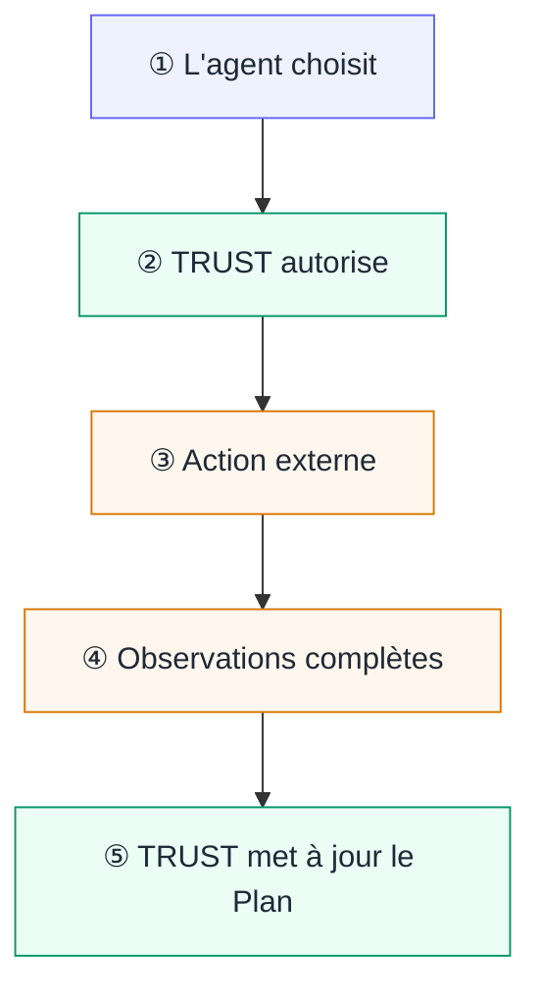

Dans l'exemple du rapport de risques, plusieurs personnes et systèmes contribuent à un même résultat. L'auteur de la Procedure décide quelle source est approuvée et quel écart est acceptable. Le responsable du système externe accorde les accès nécessaires. L'opérateur démarre et suit cette exécution précise. L'agent choisit le travail utile.

L'auteur de la Procedure écrit la règle ; TRUST porte sa version publiée en tant qu'autorité du Plan. L'agent choisit un Check actionnable, mais TRUST décide si l'action proposée respecte cette Procedure et le contexte courant. Le système de l'agent réalise une action autorisée et rapporte ses observations. Si continuer exige une décision hors du périmètre écrit, cette décision revient à l'opérateur.

TRUST appelle **Facts** les observations acceptées. Leur compte rendu n'est accepté que s'il est complet. La **qualification** est la décision motivée que TRUST calcule à partir de ces Facts et de la Procedure : les Facts nomment le compte rendu ; la qualification nomme la conclusion.

## Avant le démarrage d'un Plan

L'auteur de la Procedure définit les questions auxquelles répondre, leurs dépendances, leurs règles de qualification et les actions permises. Les Product Action Contracts définissent la forme réutilisable et le sens des Facts que ces actions doivent produire. Modifier ces décisions pour de futurs travaux exige la publication d'une nouvelle version.

Les responsables d'un système externe décident quels credentials et quelles permissions y existent. Un **Environment** est le contexte nommé choisi pour le travail : il identifie les répertoires, adresses de service et références de credentials dont une action peut avoir besoin. TRUST vérifie ce contexte avant d'autoriser l'action, mais n'accorde aucun accès au système externe. L'action utilise toujours les permissions effectives disponibles dans le système de l'agent.

L'opérateur engage une Procedure publiée sous forme de Plan avec ses entrées métier concrètes et son Environment. Il suit le travail, ferme sa Session et décide si un Plan arrêté par une escalade peut reprendre. Il ne transforme pas manuellement un Check live non résolu en réussite.

## Pendant une action

Une action se déroule comme suit.

1. **L'agent lit avant de choisir.** Il part du Plan courant, sélectionne un Check dont les dépendances sont satisfaites et propose uniquement cette action bornée.
2. **TRUST exerce l'autorité de la Procedure.** Il vérifie le Plan, le Check, les dépendances et le contexte courants. Il autorise l'Operation exacte définie pour ce Check ou refuse la demande avant le début de l'action.
3. **Le système de l'agent réalise l'action autorisée.** Le système externe peut l'accepter, la refuser ou l'interrompre selon les permissions qui y existent réellement.
4. **Le système de l'agent rapporte les observations promises.** Le résultat externe revient à l'agent, mais cette sortie ne décide pas si le Check est satisfait.
5. **TRUST applique la Procedure.** Il n'accepte qu'un compte rendu complet, qualifie les Facts obtenus, enregistre l'historique et l'état courant du Plan, puis expose le prochain travail actionnable.

## Synthèse des responsabilités

| Partie | Responsable de | Ne décide pas |
| --- | --- | --- |
| **Auteur de la Procedure** | règles d'acceptation, dépendances, raisons et limites | exécution d'un Check en cours |
| **Responsable du système externe** | credentials et accès effectifs au système visé | qualification du Plan |
| **Opérateur** | engagement, supervision, fermeture de la Session et reprise après escalade | validation manuelle d'un Check live |
| **Agent** | choix parmi les Checks actionnables, intention courante et déclaration d'escalade | certification de l'action ou qualification des Facts |
| **Système de l'agent** | exécution de l'action exacte autorisée et compte rendu complet des observations | sens métier des observations |
| **Autorité TRUST** | application de la Procedure publiée, autorisation de l'action, validation des Facts, qualification, historique immuable et état courant du Plan | action dans le système externe ou écriture des règles métier |

Il s'agit de responsabilités logiques. Une même personne peut écrire une Procedure, administrer un Environment et suivre un Plan, mais les décisions restent distinctes et inspectables.

## Résultats possibles

Une action ne se réduit pas à « réussi » ou « échoué ». Son résultat doit indiquer lequel des cas suivants s'est produit.

| Cas | Ce qui est connu | Conséquence |
| --- | --- | --- |
| **Facts acceptés ; qualification `VALIDATED`** | la tentative est terminée et les observations complètes satisfont les règles de la Procedure | le Check devient `SATISFIED` ; poursuivre avec le prochain travail actionnable |
| **Facts acceptés ; qualification `NOT_VALIDATED`** | les observations sont complètes, mais une condition écrite ne tient pas | le Check reste `OPEN` ; corriger et rejouer dans le périmètre, ou déclarer une escalade |
| **Action refusée** | TRUST n'a pas autorisé la tentative proposée ; l'action externe n'a donc pas commencé | lire la raison et le Plan courant avant un nouveau choix |
| **Compte rendu rejeté** | l'action peut avoir eu lieu, mais le compte rendu omet ou enfreint une partie de la forme requise des Facts | aucun historique d'observation, aucune conclusion ni modification de la checklist n'est enregistré ; observer à nouveau et soumettre le compte rendu complet lorsque c'est possible |
| **Échange interrompu** | l'effet externe peut être inconnu et aucun Fact accepté n'établit de nouvelle conclusion | lire l'état courant ; ne répéter l'action que si cela est sûr, sinon rendre la décision à l'opérateur |

L'autorisation permet une tentative ; le résultat externe rapporte ce qui s'est passé. Ce résultat n'est pas le verdict. La checklist change seulement après l'acceptation des Facts complets par TRUST et l'application de la Procedure. Voir [Connecter un agent](/docs/guides/connect-an-agent) pour l'installation et [Ce que fait l'agent](/docs/plans/agent) pour l'invocation et les règles de reprise.
