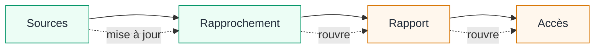

<Compare leftTitle="Identité manquante · Sécurité alimentaire" rightTitle="Observation obsolète · Aéronautique"
  left={<>
Un lot réfrigéré arrive dans un entrepôt avec une température située dans la plage acceptée. La mesure peut concerner une autre palette, précéder une rupture de la chaîne du froid ou ne pas être accompagnée d'un résultat de laboratoire requis.

<strong>TRUST doit préserver :</strong> des observations rattachées à ce lot et à cette décision de libération, pas seulement une valeur rassurante.
</>}
  right={<>
Les contrôles du carburant, de la météo et de la cabine étaient satisfaisants lors de la préparation d'un avion. Une observation ultérieure du carburant change le fondement de la décision.

<strong>TRUST doit préserver :</strong> les anciens contrôles dans l'historique tout en rouvrant la conclusion qui n'est plus justifiée par l'état courant.
</>} />

<Compare leftTitle="Source non autorisée · Reporting financier" rightTitle="Effet incertain · Paiement"
  left={<>
Une source de données de marché approuvée est indisponible, tandis qu'un prix public est facile à obtenir. L'utiliser modifierait la politique des sources au lieu de simplement terminer le rapport.

<strong>TRUST doit empêcher :</strong> qu'une substitution commode modifie silencieusement une règle appartenant à quelqu'un d'autre.
</>}
  right={<>
Une demande de paiement est envoyée, mais la connexion tombe avant la réponse. Le transfert peut avoir eu lieu.

<strong>TRUST doit empêcher :</strong> à la fois un échec inventé et une répétition susceptible de dupliquer le paiement.
</>} />

Dans chaque cas, le résultat visible laisse une question importante sans réponse. La décision exige une observation complète rattachée au bon objet, une règle pour l'interpréter et une vue à jour de ses dépendances. Lorsque la décision suivante dépasse l'autorité écrite, le travail doit s'arrêter pour laisser une personne trancher. TRUST consigne et applique cette structure ; chaque domaine fournit ses règles.

## Exemple : un rapport de risques

Prenons un agent qui prépare un rapport sur les risques d'un portefeuille pour un comité de direction. La dernière étape donne accès au rapport à un groupe de destinataires nommé. Avant de considérer ce résultat comme établi, le travail doit répondre à une suite de questions concrètes.

<Steps>
  <Step title="Sources">Quels instantanés du grand livre et des données de marché ont effectivement été utilisés ? Leurs identifiants, leurs dates, leur couverture et les expositions manquantes comptent. Un nom de fichier tel que `donnees-approuvees` ne constitue pas une traçabilité.</Step>
  <Step title="Rapprochement">Les totaux publiés concordent-ils avec ceux recalculés depuis ces sources exactes ? La commande qui produit un tableur peut réussir alors qu'une exception reste inexpliquée ou que l'écart dépasse la tolérance acceptée.</Step>
  <Step title="Rapport publié">L'artefact diffusé a-t-il été produit à partir de la révision acceptée du jeu de données ? Un rapport correct resté dans un répertoire de travail n'établit pas que les mêmes octets ont été publiés.</Step>
  <Step title="Accès">Qui peut maintenant l'ouvrir ? La réussite d'une demande de partage n'établit pas la liste d'accès effective. Elle doit correspondre au groupe autorisé pour la classification du rapport.</Step>
</Steps>

Les quatre questions deviennent quatre Checks dans un Plan en cours :

| Check | Action et observations complètes | Qualification écrite dans la Procedure |
| --- | --- | --- |
| Sources | Lire les instantanés approuvés du grand livre et des données de marché. Rapporter leurs identifiants, dates d'observation, couverture et expositions manquantes. | Les instantanés couvrent le portefeuille et la date demandés ; chaque exposition significative possède une source approuvée. |
| Rapprochement | Recalculer les agrégats depuis ces sources. Rapporter le total recalculé, le total publié, l'écart et les exceptions non résolues. | L'écart respecte la tolérance déclarée et aucune exception significative ne reste inexpliquée. |
| Artefact du rapport | Lire les métadonnées du rapport produit. Rapporter la révision du jeu de données, la date de génération et l'empreinte du contenu. | L'artefact a été produit depuis le jeu de données exact accepté par les Checks précédents. |
| Diffusion | Appliquer l'accès déclaré. Relire la liste d'accès effective et la rapporter. | Les destinataires effectifs sont exactement le groupe autorisé pour la classification du rapport. |

Le sens et la forme requise des observations sont écrits à l'avance. La Procedure indique quelles sources, quelle tolérance et quels destinataires sont acceptés pour ce travail. Aucune de ces décisions ne vient de TRUST ; il les applique et permet d'inspecter leur application.

## Ce qui change lorsqu'une source change

Supposons qu'une observation ultérieure révèle qu'un instantané de données de marché était incomplet. L'ancien enregistrement n'est pas effacé : il reste dans l'historique. La qualification courante du Check des sources change cependant ; les Checks de rapprochement, d'artefact et de diffusion sont donc rouverts. Le Plan ne présente plus comme courantes les conclusions construites sur cette source.

Ce comportement évite une défaillance discrète. Sans un état courant sensible aux dépendances, un rapport peut conserver une série de résultats positifs alors que son fondement a changé. La réouverture ne prétend pas que chaque action en aval a été mal exécutée. Elle indique que sa conclusion doit être établie à nouveau à partir des dépendances courantes.

## Lorsque la source approuvée est indisponible

Si le Check des sources renvoie des observations complètes montrant qu'un instantané manque, le compte rendu est accepté, mais le Check reste non résolu. L'agent peut interroger à nouveau la source approuvée ou employer un autre remède explicitement permis par la Procedure. Il ne doit pas substituer un prix public non approuvé, changer la date du rapport, élargir la tolérance ou diffuser un rapport incomplet dans le seul but de terminer le Plan.

Lorsque les corrections autorisées sont épuisées, l'agent consigne l'instantané manquant comme raison du blocage et la substitution interdite comme action qu'il n'effectuera pas. Le rapport reste non diffusé jusqu'à ce qu'un opérateur résolve le problème de source ou que les responsables publient une nouvelle version de la Procedure.

<Callout kind="note" title="Pourquoi cet exemple n'est pas une affirmation réglementaire">
  L'exemple reprend des préoccupations concrètes du reporting de risques : exactitude, exhaustivité, rapidité, rapprochement, traçabilité des données et diffusion appropriée. Ces préoccupations figurent dans les [principes d'agrégation des données et de reporting des risques](https://www.bis.org/committees/bcbs/basel-framework/standard/srp/36/inforce/2019-12-15/published/2019-12-15) du Comité de Bâle et dans son [bilan de mise en œuvre de 2026](https://www.bis.org/publications/implementation-principles-effective-risk-data-aggregation-and-risk-reporting-bcbs-239-principles). L'exemple illustre la manière dont une organisation pourrait formaliser ses propres contrôles. Il n'établit pas la conformité à ces principes.
</Callout>

## Autres exemples

| Domaine | Travail délégué | Ce qui doit être établi indépendamment |
| --- | --- | --- |
| Évolution logicielle | Lire un ticket, modifier un projet, lancer sa vérification et créer un commit. | Le ticket est éligible, l'état de départ est connu, la révision attendue a été testée et l'arbre de travail possède l'état requis. |
| Admission d'un patient | Lire les dossiers du patient, du consentement et de la couverture, puis enregistrer l'admission. | Les dossiers concernent le même patient, le consentement et la couverture requis sont à jour, et le résultat de l'admission existe. |
| Départ d'un avion | Lire l'état de l'appareil, du carburant, de la météo et de la cabine, puis autoriser le départ. | Chaque observation s'applique au vol déclaré et reste valable pour la décision de départ. |
| Libération d'un lot alimentaire | Lire les dossiers du lot, du laboratoire et de la chaîne du froid, puis libérer le lot. | Les résultats requis sont complets, rattachés au lot et dans les limites d'acceptation écrites. |

TRUST ne contient pas de définition générique d'une évolution, d'une admission, d'un départ, d'un lot ou d'un rapport financier correct. Chaque domaine fournit ses propres observations, Procedures et règles de décision.
