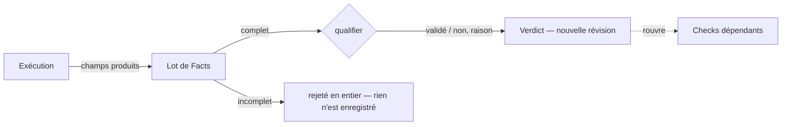

## Facts

Un **Fact** est une observation typée : un champ produit d'une Opération avec sa valeur, rapporté par une exécution. Sur un Plan live, le Runner les rapporte après avoir exécuté l'Opération ; sur un dry-run, l'opérateur les saisit.

Un Check est qualifié à partir d'un **lot complet** : chaque champ nommé par ses attentes, et chaque champ qu'il matérialise, doivent être présents. Un lot incomplet est **rejeté en entier** — pas de Fact, pas d'enregistrement, pas de verdict, aucun changement du Plan. L'exécution peut être répétée ; c'est la réponse normale à un rejet.

Des Facts identiques soumis deux fois donnent le même enregistrement une seule fois : TRUST déduplique le lot, l'enregistrement et le verdict.

## Verdicts

Les attentes du Check sont évaluées dans l'ordre du tableau au regard des Facts et du contexte courant du Plan.

- Toutes les lignes tiennent → **validé**, avec la raison de succès du Check.
- Une ligne échoue → **non validé**, avec la raison d'échec de cette ligne.

Le verdict remplace le verdict actif du Check. Chaque verdict précédent reste dans l'historique avec ses Facts.

## La cascade

De nouveaux Facts acceptés sur un Check recalculent son verdict et **rouvrent chaque Check qui en dépend** :

- les Checks des Scénarios qui requièrent son Scénario ;
- les Checks qui utilisent un rôle qu'il matérialise ;
- les Checks dont les attentes comparent avec l'un de ses champs.

Les Checks rouverts reviennent à *ouvert* ; leurs verdicts précédents restent dans l'historique. L'agent reprend depuis n'importe quel Check dont les dépendances sont satisfaites.

## Rejeu

Parce que le rejet est atomique et que les Facts identiques sont dédupliqués, **rejouer** une exécution est sûr par construction : après un lot rejeté, un rapport interrompu ou une réponse perdue, le Runner exécute l'Opération à nouveau. TRUST n'implémente pas de mécanisme générique d'exactly-once ; les rares actions qui ne peuvent pas être rejouées après une issue inconnue relèvent de l'opérateur, pas d'une barrière du produit.

<Callout kind="rule">
  Les Facts et les enregistrements sont un historique immuable. Seule la qualification active dans la révision courante est remplaçable.
</Callout>
