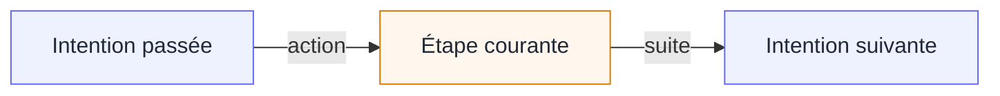

Deux formes d'échec sont en jeu. L'agent peut prendre un résultat non observé pour une réussite, ou fermer le travail alors qu'une question importante reste ouverte. Sur une longue Session, une checklist écrite une fois au départ peut aussi perdre son lien avec les actions réellement menées.

Le chaînage d'intentions indique ce que l'agent cherche à accomplir ensuite et conserve cette direction pendant le travail. L'escalade consigne un arrêt normal lorsque l'agent n'a plus l'autorité ou les moyens de continuer.

## Escalade

Même sans voie légitime pour continuer, l'agent reste incité à terminer. Faute de sortie explicite, trois réactions courantes peuvent rendre le compte rendu trompeur ou l'action dangereuse.

<Callout kind="warning" title="Ce que l'escalade empêche">
  - **Réussite inventée.** L'agent suppose que le résultat attendu existe, puis poursuit à partir d'un résultat qui n'a jamais été établi.
  - **Clôture prématurée.** Il s'arrête sans expliquer ce qui reste non résolu ni qui doit maintenant décider.
  - **Travail hors du périmètre convenu.** Il substitue une source, assouplit une règle ou modifie un système voisin pour supprimer le blocage.
</Callout>

Dans l'exemple du rapport de risques, un instantané approuvé de données de marché est indisponible. Un prix public permettrait de terminer le tableur, mais modifierait aussi la règle sur les sources. L'agent peut réessayer une source ou une correction autorisée. Il ne peut ni inventer la valeur manquante, ni choisir une nouvelle source, ni élargir la tolérance, ni publier un rapport incomplet.

Une escalade nomme le blocage observé et l'action ultérieure que l'agent n'effectuera pas. Le Check reste non résolu et la décision passe à un opérateur dont le périmètre d'autorité est différent. Le travail déjà consigné est préservé. L'escalade fait partie des issues normales d'une délégation bornée.

<Screenshot id="plan-escalated" caption="Un Plan en escalade conserve le Check non résolu et présente la frontière de l'opérateur." legend={{
  "overlay.header": "Le Plan est visiblement en escalade ; son identité et sa Procedure restent inchangées.",
  "plan.summary": "L'escalade active expose le blocage, l'action volontairement non réalisée et l'action Reprendre réservée à l'opérateur.",
  "plan.checklist": "Le Check reste dans la checklist. L'escalade ne le transforme pas en réussite et ne le retire pas.",
  "plan.escalation": "Les deux déclarations de l'agent sont rendues comme prose d'audit ; les images externes et contenus actifs ne sont pas exécutés.",
}} />

## Chaînage d'intentions

Une checklist montre ce qu'il reste à faire, mais une déclaration faite une fois au départ ne suffit pas toujours à tenir le fil d'une longue Session. Après de nombreuses actions, l'agent peut répéter du travail, poursuivre une direction périmée ou estimer que sa propre part est terminée alors que le Plan ne l'est pas.

Lorsque le chaînage est activé, l'agent rappelle l'<Term id="intent">intention</Term> qui l'a conduit au Check courant et déclare ce qu'il cherche à accomplir ensuite. Chaque étape terminée crée ainsi trois points d'ancrage :

L'intention suivante devient le point de départ de l'action suivante. Si la question courante reste non résolue, l'intention précédente demeure afin que la correction et la nouvelle tentative conservent leur contexte. Seul le Check capable de terminer le Plan omet l'intention suivante.

L'intention ne choisit pas le Check, ne rapporte aucune observation et ne décide pas si l'action a réussi. Elle consigne la raison pour laquelle l'agent continue. La Procedure et les observations déterminent toujours la checklist.

Le contrat du runtime est plus strict que le parcours conceptuel ci-dessus :

- Une Procedure active le mécanisme avec `@intent-chaining`. La première lecture du Plan crée l'intention courante gérée par le système.
- L'admission d'une Attempt exige la valeur courante exacte. Tant qu'il reste du travail, elle exige aussi une valeur suivante distincte ; une seule Attempt en cours réserve ce maillon.
- Une finalisation avec des Facts acceptés et `VALIDATED` fait de la valeur suivante l'intention courante. `NOT_VALIDATED` libère la réservation et conserve la valeur courante. Un refus ne change aucune des deux valeurs.
- L'escalade n'est acceptée que pour la dernière Attempt finalisée `NOT_VALIDATED` du Check ouvert courant. Elle place le Plan dans l'état `ESCALATED` sans créer de Snapshot, de verdict ni de révision du Plan.
- `plan.resume` exige l'identifiant de l'escalade active et un `resumeReason` non vide. L'agent doit ensuite relire le Plan et reprendre avec le Check et l'intention préservés.

Voir [Ce que fait l'agent](/docs/plans/agent) pour le parcours d'invocation et de reprise, et la [référence du DSL TRUST](/docs/language) pour la syntaxe du chaînage d'intentions.

