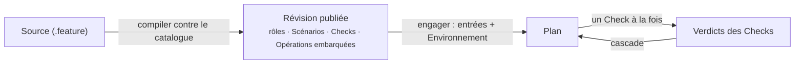

Une <Term id="procedure">Procédure</Term> décrit un Plan : les **rôles** typés de son contexte, les **Scénarios** qui regroupent ses Checks et les ordonnent, et pour chaque <Term id="check">Check</Term> l'Opération qu'il exécute, la façon dont le contexte lie l'Input de l'Opération, et la **qualification** typée qui rend le Check validé. Une Procédure est compilée contre le catalogue d'Opérations et **publiée** comme une révision versionnée qui embarque les Opérations exactes qu'elle utilise.

> Une Procédure dit ce qui doit être établi, dans quel ordre, et à partir de quels champs observés. Elle ne dit jamais comment appeler un système — c'est le travail de l'Opération.

```gherkin procedure id="git-status" title="git-status — la plus petite Procédure"
# language: en
@trust-dsl:1 @procedure:git-status @version:2.0.0
Feature: Establish whether a Git repository has local changes

  Answers one question about a repository checked out below the workspace: does it carry
  local changes? A single Check reads the working tree; the Plan is satisfied only when it
  is dirty.

  Background: Plan context
    Given Procedure scope
      | check | authorized | forbidden |
      | all   | Read the declared repository state. | Modify the repository or its environment to obtain the expected state. |
    Given one reference "repository"

  @scenario:repository-status
  Scenario: Read the repository status
    Then Check "repository status" runs Operation "git.head-read"
        on "repository" as Input "project"
        and must establish "the repository has local changes"
      """js
      fact.workingTree === "dirty" ||
      fail("the repository has no local changes")
      """
```

## De quoi est faite une Procédure

| Partie | Où | Rôle |
| --- | --- | --- |
| Identité | tags sur `Feature:` | `@procedure:<slug>`, `@version` sémantique, `@trust-dsl:1` |
| Titre et description | ligne `Feature:` et texte libre en dessous | ce que la Procédure établit, pour les humains ; affiché sur sa page et ses Plans |
| **Contexte du Plan** | `Background: Plan context` | un rôle typé par ligne : une entrée de Plan, une déclaration de l'agent, une valeur fixe, ou une valeur matérialisée par un Check |
| **Périmètre de la Procedure** | premier `Given` obligatoire du Background | limites en prose pour `all` les Checks et, facultativement, pour un Check nommé : ce qui est autorisé et interdit |
| **Scénarios** | `@scenario:<slug>` + `Scenario:` | prérequis (`Given scenario "…" is validated`) suivis d'un ou plusieurs Checks |
| **Checks** | `Then Check "…" runs Operation "…" …` | une Opération sur un rôle cible, liaisons d'Input, matérialisations, raison de succès, qualification `js` |

## Comment une Procédure est utilisée



1. **Rédaction.** La source est écrite dans l'interface ou dans un éditeur. Le compilateur résout chaque Opération référencée, valide chaque liaison et chaque qualification typée, et renvoie une Procédure compilée ou un diagnostic avec une ligne.
2. **Publication.** Le runtime stocke la révision `procedure@version` avec les Opérations exactes qu'elle embarque. Elle ne change plus jamais ensuite.
3. **Engagement.** Un Plan est engagé à partir d'une version publiée avec ses entrées racines et un Environnement ; les Checks initiaux sont créés. Les déclarations de l'agent sont remplies plus tard par l'agent ; les rôles matérialisés sont remplis par des Checks.
4. **Exécution.** Les Checks deviennent actionnables quand les prérequis de leur Scénario sont validés ; chaque exécution acceptée produit un verdict et rouvre les Checks dépendants.

<Callout kind="rule">
  Une révision publiée est autonome. Modifier une Opération du catalogue, ou la source de la Procédure, ne change aucune version publiée — une nouvelle version est publiée à la place.
</Callout>

<PageCards />
