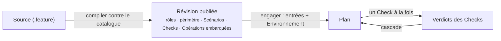

Une <Term id="procedure">Procédure</Term> transforme une attente métier en questions que TRUST peut suivre. Elle définit les personnes, systèmes et objets concernés, les <Term id="check">Checks</Term> à résoudre, leur ordre, ainsi que les actions autorisées ou interdites pour y répondre. Elle peut aussi demander à l'agent d'indiquer comment un Check mène au suivant.

Chaque Check lie une <Term id="operation">Opération</Term>, les informations dont elle a besoin et une règle de qualification. La Procédure est compilée contre le catalogue d'Opérations puis publiée comme une révision versionnée qui embarque les Opérations exactes qu'elle utilise.

> Une Procédure dit ce qui doit être établi, dans quel ordre et à partir de quelles observations. L'Opération dit comment agir sur le système externe.

## Pourquoi écrire l'attente sous forme de Procédure

Une instruction comme « vérifier le rapport et le partager » laisse des décisions importantes implicites. Quel rapport ? Quelles sources le rendent fiable ? La vérification doit-elle précéder la diffusion ? Que peut faire l'agent si une source manque ? Une Procédure rend ces décisions visibles, révisables et stables d'une exécution à l'autre.

Le langage décrit donc plus qu'une séquence. Il consigne les rôles du contexte, les dépendances, les règles et raisons de qualification, le périmètre autorisé et, facultativement, la <Term id="intent">chaîne d'intention</Term> qui relie un Check au suivant.

## Comment une Procédure est utilisée

<PageCards />
